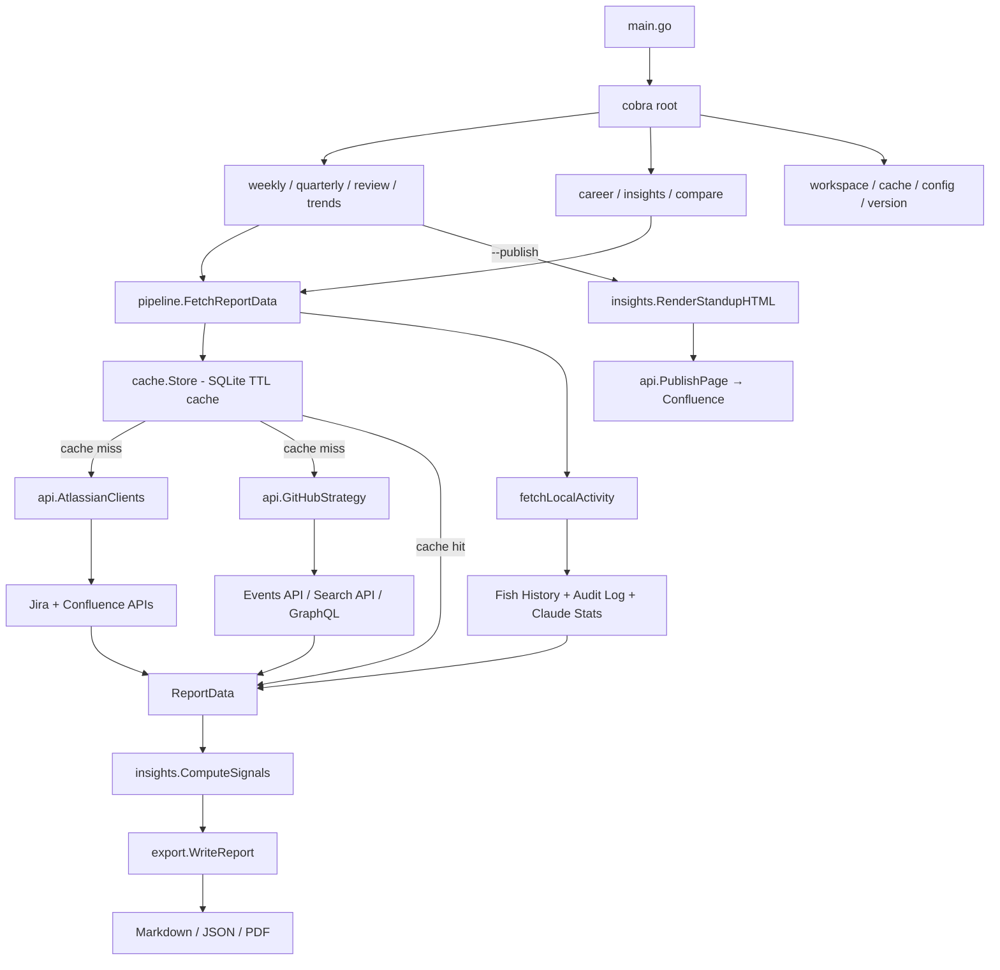

# workctl

A personal command-line tool for individual contributors to reflect on their own work activity across Atlassian (Jira & Confluence) and GitHub. Generate self-review reports, export your data locally, and understand your own growth signals — on your terms, on your machine.

**Target Audience**: Individual contributors who want to understand their own work patterns and prepare for performance conversations with confidence.

## Philosophy

workctl is a **personal tool for self-growth**. It exists to help individual contributors reflect on their own work — spot patterns, review career signals, and prepare for performance conversations with data they already own.

It is **not** a team management dashboard. It is **not** a way for managers to review reports about other people. It does not aggregate across people, rank individuals, or produce org-level metrics. If you're looking for a tool to assess your team's output, this isn't it.

The design principle is simple: **your work data, your insights, your growth.** Every feature — career lenses, signal extraction, trend comparison — is built for the person doing the work to understand themselves better.

## Privacy Philosophy

workctl is designed with privacy as a core principle, not an afterthought:

- **Your data stays local.** There is no telemetry, no server uploads, no cloud sync. All fetched data lives on your machine in local files. Period.
- **You control every data source.** Jira, Confluence, and GitHub are all opt-in. Nothing is fetched until you explicitly provide credentials and run a command. You choose what to query, for what date range, and where to store the results.
- **No cross-person aggregation by design.** workctl queries data about *you* — your issues, your pages, your commits. It does not compare you to others, rank individuals, or build org-wide profiles. The data model has no concept of "team."
- **No network calls you didn't ask for.** workctl only contacts the APIs you configure (Atlassian, GitHub). There are no analytics pings, no update checks, no background network activity.
- **Defense in depth.** Debug logs redact PII (emails masked, display names replaced). The SQLite cache enforces decompression size limits. Output file paths are sanitized to prevent directory traversal. Sensitive shell history values (passwords, tokens) are redacted before processing. Use `--redact-others` to mask third-party names and emails in report output. Set `WORKCTL_CACHE_PASSPHRASE` to encrypt the SQLite cache at rest using X25519/ChaCha20-Poly1305 (`filippo.io/age`).

## 📋 Table of Contents

- [Status](#status)
- [Philosophy](#philosophy)
- [Privacy Philosophy](#privacy-philosophy)
- [Quick Start](#quick-start)
- [For AI Agents](#for-ai-agents)
- [Architecture Overview](#architecture-overview)
- [Features](#features)
- [Requirements](#requirements)
- [Development Setup](#development-setup)
- [Usage](#usage)
- [Workspace Management](#workspace-management)
- [SRE Operations Guide](#sre-operations-guide)
- [DevEx & Contributing](#devex--contributing)
- [Technical Details](#technical-details)
- [Troubleshooting](#troubleshooting)
- [References](#references)

## Status

**EPICs 001–021 complete on `main`.** Active production use for weekly standup generation against grindr Jira/Confluence/GitHub (`blo-grindr`). Weekly report workflow validated week 12 (2026-03-20).

### Shipped EPICs (001–021)
- `796c5ff` (2026-03-20) — docs: standup workflow validated; weekly report format updated
- `e195400` (2026-03-06) — EPIC-021 E3 — `ExtractLocalSignals()` unifies local signal extraction
- `0bec745` (2026-03-06) — EPIC-021 E2 — refactor `fetchLocalActivity()` to use `EventsClient`
- `4aeb59d` (2026-03-06) — EPIC-021 E1 — `EventsClient` unified typed events reader
- `253fd91` (2026-03-05) — EPIC-019/020/021 — events-native signals, sessions, automation_maturity; 20 pkgs green
- `b565ed6` (2026-03-04) — close EPIC-018 milestone issues (`workctl-i74`, M1–M5)
- `8c57a83` (2026-03-04) — EPIC-018: remove Ollama, promote `RulesExtractor` at `TierRules`

| EPIC | Title | Status |
|------|-------|--------|
| 001–009 | Data collection, GitHub, cache, config, career insights, testing | Complete |
| 010 | Personal report generation (weekly/quarterly/review) | Complete |
| 011 | Trend analysis (N-period comparison) | Complete |
| 012 | Workflow DX (color, spinners, cache warming) | Complete |
| 013 | Technical foundation (data architecture cleanup) | Complete |
| 014 | Confluence standup publisher | Complete |
| 015 | Local shell & AI activity integration | Complete |
| 016 | Pluggable pipeline (Source/Extractor/Sink interfaces) | Complete |
| 017 | Legacy history migration | Superseded (DEVTOOLS EPIC-017) |
| 018 | Ollama deprecation → RulesExtractor promotion | Complete |
| 019 | Events-native AI signals (session summaries, cost, tool distribution, layer breakdown) | Complete |
| 020 | Session & topology signals (`workctl events`, graduation density, anti-pattern rate) | Complete |
| 021 E1 | `EventsClient` — unified typed events reader for all layers | Complete |
| 021 E2 | `fetchLocalActivity()` refactored to use `EventsClient` with pre-2026-01-23 fallback | Complete |
| 021 E3 | `ExtractLocalSignals()` replaces split `ExtractShellSignals()` + `ExtractAISignals()` | Complete |
| 021 E4+E5 | `automation_maturity` 10th career dimension (agent/total ratio, ceiling 0.75) | Complete |

**Last Updated:** 2026-03-20 (weekly standup workflow production-validated; report format updated)

---

## 🚀 Quick Start

**For end users:**
```bash
# Set up environment
export ATLASSIAN_DOMAIN="yourcompany.atlassian.net"
export ATLASSIAN_EMAIL="your.email@company.com"
export ATLASSIAN_API_TOKEN="your_api_token"

# Build and run
make build
./bin/workctl --project-keys "SR,ISRE" --start 2025-01-01 --end 2025-01-31 --summary
```

**For developers:**
```bash
# Clone and setup
git clone <repo-url>
cd workctl

# Install dependencies
go mod download

# Run tests
make test

# Build
make build

# Try it out
make example-project
```

## 🤖 For AI Agents

This project uses **bd (beads)** for issue tracking. See [AGENTS.md](AGENTS.md) for complete agent workflow.

**Essential Commands:**
```bash
bd ready              # Find available work
bd show <id>          # View issue details
bd update <id> --status in_progress
bd close <id>         # Complete work
bd sync               # Sync with git
```

**Before committing:**
1. Run tests: `make test`
2. Run linters: `make lint`
3. Update issues: `bd sync`
4. Push changes: `git push`

**Code Navigation:**
- Entry point: `cmd/workctl/main.go`, `cmd/workctl/root.go`
- Subcommands: `weekly_cmd.go`, `quarterly_cmd.go`, `review_cmd.go`, `trends_cmd.go`, `career_cmd.go`, `workspace_cmd.go`, `cache_cmd.go`, `insights_cmd.go`, `compare_cmd.go`, `standup_cmd.go`, `events_cmd.go`
- Shared flags: `cmd/workctl/flags.go`
- Fetch pipeline: `cmd/workctl/pipeline.go`
- API clients: `internal/api/atlassian.go`, `internal/api/jira.go`, `internal/api/confluence.go`, `internal/api/confluence_publish.go`, `internal/api/github.go`, `internal/api/github_strategy.go`, `internal/api/sources.go`
- Local data sources: `internal/api/events_client.go` (primary), `internal/api/fish_history.go` (pre-2026-01-23 fallback), `internal/api/audit_log.go`, `internal/api/claude_stats.go`, `internal/api/shell_classifier.go`
- Configuration: `internal/config/config.go`, `internal/config/file.go`, `internal/config/resolve.go`, `internal/config/xdg.go`
- Data models: `internal/models/models.go`
- Signals & career: `internal/insights/signals.go`, `internal/insights/tracks.go`, `internal/insights/compare.go`, `internal/insights/review.go`, `internal/insights/standup_html.go`
- Report export: `internal/export/report.go`, `internal/export/json.go`, `internal/export/pdf.go`, `internal/export/file_sink.go`, `internal/export/confluence_sink.go`
- Templates: `internal/templates/templates.go`
- Signal extraction: `internal/ai/rules_extractor.go`, `internal/ai/models.go`, `internal/ai/metrics.go`, `internal/ai/correlation.go`, `internal/ai/parser.go`, `internal/ai/process.go`
- Pipeline interfaces: `internal/pipeline/source.go`, `internal/pipeline/extractor.go`, `internal/pipeline/sink.go`, `internal/pipeline/metrics.go`
- Local cache: `internal/cache/store.go`, `internal/cache/encrypt.go`, `internal/cache/fetch.go`, `internal/cache/ttl.go`
- UI (color, spinner): `internal/ui/color.go`, `internal/ui/spinner.go`
- Version info: `internal/version/version.go`
- Workspace: `internal/workspace/workspace.go`
- Telemetry: `internal/telemetry/emit.go`

**Project Status:** All 18 core EPICs complete. EPIC-019 complete, EPIC-020 complete, EPIC-021 E4+E5 shipped (Events Integration + Automation Maturity).

## 🏗 Architecture Overview

**Execution Flow:**


**Package Responsibilities:**

| Package | Purpose | Key Files |
|---------|---------|-----------|
| `cmd/workctl` | CLI entry point, cobra subcommands, flag definitions, pipeline orchestration | `main.go`, `root.go`, `pipeline.go`, `flags.go`, `*_cmd.go` |
| `cmd/ghwatch` | Standalone GitHub PR/push/workflow watcher daemon | `main.go` |
| `internal/api` | API clients (Jira v3, Confluence v1/publish, GitHub hybrid strategy) + local data sources (fish history, audit log, Claude stats) + pipeline source adapters | `atlassian.go`, `jira.go`, `confluence.go`, `confluence_publish.go`, `github.go`, `github_strategy.go`, `fish_history.go`, `audit_log.go`, `claude_stats.go`, `shell_classifier.go`, `sources.go` |
| `internal/cache` | SQLite result cache with per-source TTL, incremental warming, and optional age encryption at rest | `store.go`, `encrypt.go`, `fetch.go`, `key.go`, `ttl.go` |
| `internal/config` | YAML config file, profile resolution, XDG base directories | `config.go`, `file.go`, `resolve.go`, `xdg.go` |
| `internal/export` | Report serialization — NaN-safe JSON structs, pandoc PDF wrapper, pipeline sinks (file, Confluence) | `report.go`, `json.go`, `pdf.go`, `file_sink.go`, `confluence_sink.go` |
| `internal/insights` | Signal computation, career track scoring, delta/trend analysis, standup HTML renderer | `signals.go`, `tracks.go`, `compare.go`, `review.go`, `report.go`, `standup_html.go` |
| `internal/models` | Core data structures (Issue, Article, GitHubActivity, QueryConfig) | `models.go` |
| `internal/templates` | Embedded Go report templates (`weekly.tmpl`, `quarterly.tmpl`, `review.tmpl`) | `templates.go` |
| `internal/ai` | RulesExtractor (pipeline.Extractor at TierRules), signal-to-prompt metrics, cross-signal correlation, response parsing | `rules_extractor.go`, `models.go`, `metrics.go`, `correlation.go`, `parser.go`, `process.go` |
| `internal/pipeline` | Pluggable Source/Extractor/Sink interfaces, MultiSink (file-first ordering), MetricsWriter for local-ai log emission | `source.go`, `extractor.go`, `sink.go`, `metrics.go` |
| `internal/ui` | TTY-aware color output and `\r`-based progress spinners | `color.go`, `spinner.go` |
| `internal/version` | Build metadata injected at link time (version, commit, build date) | `version.go` |
| `internal/workspace` | Workspace directory scaffolder (Jira + GitHub issue modes) | `workspace.go` |
| `internal/telemetry` | Go CLI telemetry via emit_jsonl event emission | `emit.go` |
| `internal/summary` | Legacy summary statistics (`--summary` flag for raw-data mode) | `summary.go` |

**Data Flow:**
1. **Input** → CLI flags + config file + profile → resolved `QueryConfig`
2. **Cache Check** → `cache.Store` (SQLite, per-source TTL) → cache hit or miss
3. **API Query** → Atlassian/GitHub APIs (on cache miss) → raw JSON responses
4. **Local Activity** → Fish history + audit log + Claude stats → `ShellCommand`, `AuditEvent`, `AIActivity`
5. **Transform** → API models → `Issue`, `Article`, `GitHubActivity` internal models
6. **Signal Extraction** → `insights.ComputeSignals()` → `SignalSet` (velocity, themes, collaboration, shell activity, AI activity)
7. **Report Assembly** → `ReportData` struct → templates + format dispatch
8. **Output** → Markdown (default) / JSON (NaN-safe) / PDF (via pandoc) / Confluence HTML (`--publish`); sibling `.signals.json` written alongside every Markdown report (`schema_version`, `extractor_tier`, full `SignalSet`)

**External Dependencies:**
- `github.com/spf13/cobra` - CLI framework (subcommand routing, flag handling)
- `github.com/ctreminiom/go-atlassian/v2` - Atlassian API client (see `dev-docs/go-atlassian/`)
- `github.com/google/go-github/v81` - GitHub API client (see `dev-docs/go-github/`)
- `github.com/fatih/color` - TTY-aware terminal color output
- `gopkg.in/yaml.v3` - YAML config file parsing
- `modernc.org/sqlite` - Pure-Go SQLite (result cache storage)
- `golang.org/x/time/rate` - Token-bucket rate limiter for Atlassian API (burst-capable, context-cancellable)

## 🎯 Features

- **User Mode**: Fetch Jira issues assigned to a specific user
- **Project Mode**: Fetch all Jira issues from specified projects (regardless of assignee)
- **Space Mode**: Fetch all Confluence pages from specified spaces
- **Mixed Mode**: Combine project and space queries
- **GitHub Mode**: Fetch GitHub activity (commits, PRs, issues) for a specific user
- **Filtering**: Filter by status, type, priority (Jira) and content type (Confluence)
- **Summary Statistics**: Generate aggregated summaries by status, project, assignee, space, repository, etc.
- **Weekly Reports**: `workctl weekly` — 7-day career-signals insights report (md/json/pdf)
- **Quarterly Reports**: `workctl quarterly` — 90-day delta report showing growth across all signals (md/json/pdf)
- **Annual Review**: `workctl review` — 365-day insights + career track report (md/json/pdf)
- **Trend Analysis**: `workctl trends` — N-period comparison showing how work patterns evolve over time (md/json/pdf)
- **Multi-format export**: `--format md` (default), `--format json` (NaN-safe, machine-readable), `--format pdf` (via pandoc)
- **Career Lens**: Score against built-in tracks (staff, platform, manager) or custom tracks with inheritance; `--all-tracks` multi-track scoring
- **Confluence Standup Publisher**: `workctl weekly --publish` — generate and publish a standup page directly to Confluence with activity summary, completed work, code impact, and optional narrative notes
- **Local Shell Activity**: Fish shell history analysis — tool frequency, infra command counts, deploy operations, working hours distribution (no credentials required)
- **AI-Assisted Work Signals**: Claude Code stats integration — session/message/tool call counts, token usage, human vs agent command separation
- **Events Summary**: `workctl events` — summarize local automation-metrics events by layer, session count, tool distribution, and estimated cost (no credentials required)
- **Session & Topology Analysis**: Deduplicated session metrics (multi-project sessions, avg events/tools per session, longest session), graduation density, and anti-pattern rate
- **Automation Maturity**: 10th career dimension measuring AI-assisted work intensity (agent commands / total commands ratio)
- **Version info**: `workctl version` and `workctl --version` work with zero configuration — no credentials required
- Export data to JSON format with timezone conversion
- Rate limiting (1 request/second) and automatic retry logic with backoff
- **Security hardening**: PII redaction in debug logs, cache decompression limits, output path sanitization, shell history sensitive value redaction, `--redact-others` report-level name/email masking, optional cache encryption at rest (`WORKCTL_CACHE_PASSPHRASE`)
- Debug logging support

## Requirements

- Go 1.25.4 or higher
- Atlassian API token with appropriate permissions
- Access to Jira and Confluence Cloud instances

## Dependencies

Key dependencies (see `go.mod` for the full list):

```
github.com/spf13/cobra v1.10.2                # CLI framework
github.com/ctreminiom/go-atlassian/v2 v2.9.0  # Atlassian API client
github.com/google/go-github/v81 v81.0.0       # GitHub API client
github.com/fatih/color v1.18.0                # TTY-aware color output
gopkg.in/yaml.v3 v3.0.1                       # YAML config parsing
modernc.org/sqlite v1.45.0                    # Pure-Go SQLite (result cache)
golang.org/x/time v0.14.0                     # Token-bucket rate limiter (Atlassian API)
filippo.io/age v1.3.1                         # Cache encryption at rest (X25519/ChaCha20-Poly1305)
github.com/cenkalti/backoff/v4 v4.3.0         # Exponential backoff with jitter (retry handling)
golang.org/x/sync v0.19.0                     # singleflight (deduplicate concurrent cache misses)
github.com/spf13/pflag v1.0.9                 # POSIX flag parsing (cobra dependency, used directly)
github.com/stretchr/testify v1.11.1           # require/assert test helpers (test-only)
```

To install dependencies:

```bash
go mod download
```

## Environment Variables

Set the following environment variables before running the script:

**For Atlassian (Jira & Confluence):**
```bash
export ATLASSIAN_DOMAIN="yourcompany.atlassian.net"
export ATLASSIAN_EMAIL="your.email@company.com"
export ATLASSIAN_API_TOKEN="your_api_token_here"
```

**For GitHub:**
```bash
export GITHUB_TOKEN="ghp_your_github_token_here"
```

**Optional — Cache Encryption at Rest:**
```bash
export WORKCTL_CACHE_PASSPHRASE="your-passphrase"
```
When set, workctl encrypts all SQLite cache BLOBs using X25519/ChaCha20-Poly1305 (`filippo.io/age`). A key file is generated once at `~/.config/workctl/cache.key.age` and reused on subsequent runs. Unencrypted (legacy) cache entries are read transparently and re-encrypted on next write. The cache is non-authoritative — losing the passphrase forces a re-fetch from APIs.

### Generating an API Token

**Atlassian API Token:**
1. Go to https://id.atlassian.com/manage-profile/security/api-tokens
2. Click "Create API token"
3. Give it a label and copy the token value
4. Store it securely as `ATLASSIAN_API_TOKEN`

**GitHub Personal Access Token:**
1. Go to https://github.com/settings/tokens
2. Click "Generate new token" (classic)
3. Select scopes: `repo`, `read:user`
4. Copy the token value
5. Store it securely as `GITHUB_TOKEN`

## 🛠 Development Setup

### Prerequisites

- **Go 1.25.4+** - Required for building
- **Git** - For version control
- **Make** - For build automation (optional but recommended)
- **bd (beads)** - For issue tracking (`curl -fsSL https://raw.githubusercontent.com/steveyegge/beads/main/scripts/install.sh | bash`)
- **Atlassian API credentials** - See Environment Variables section

### First-Time Setup

```bash
# 1. Clone the repository
git clone <repo-url>
cd workctl

# 2. Initialize beads for issue tracking
bd init

# 3. Install Go dependencies
go mod download

# 4. Set up environment variables
cat > .env <<EOF
export ATLASSIAN_DOMAIN="yourcompany.atlassian.net"
export ATLASSIAN_EMAIL="your.email@company.com"
export ATLASSIAN_API_TOKEN="your_api_token"
EOF

source .env

# 5. Build the project
make build

# 6. Run tests to verify setup
make test

# 7. Try an example query
make example-project
```

### Development Workflow

**Daily development cycle:**
```bash
# 1. Check for work
bd ready

# 2. Claim a task
bd update <id> --status in_progress

# 3. Make changes
# ... edit code ...

# 4. Run tests
make test

# 5. Run linters
make lint

# 6. Build
make build

# 7. Try it locally
./bin/workctl --project-keys "SR" --start 2025-01-01 --end 2025-01-31 --debug

# 8. Complete task
bd close <id>

# 9. Sync and push
bd sync
git add .
git commit -m "Your message"
git push
```

### Project Structure (Detailed)

```
workctl/
├── cmd/
│   ├── workctl/
│   │   ├── main.go              # Entry point, cobra setup
│   │   ├── root.go              # Root command, global flags
│   │   ├── pipeline.go          # FetchReportData, WarmReportData — unified fetch pipeline
│   │   ├── flags.go             # Shared flag registration helpers across subcommands
│   │   ├── period_helpers.go    # Period/trend window utilities
│   │   ├── format_cmd.go        # Shared format/output dispatch (WriteReport)
│   │   ├── weekly_cmd.go        # workctl weekly — 7-day career signals report
│   │   ├── quarterly_cmd.go     # workctl quarterly — 90-day delta report
│   │   ├── review_cmd.go        # workctl review — 365-day annual review
│   │   ├── trends_cmd.go        # workctl trends — N-period trend comparison
│   │   ├── career_cmd.go        # workctl career — career track scoring
│   │   ├── insights_cmd.go      # workctl insights — signal breakdown view
│   │   ├── compare_cmd.go       # workctl compare — two-period delta
│   │   ├── workspace_cmd.go     # workctl workspace init — workspace scaffolder
│   │   ├── cache_cmd.go         # workctl cache stats/clear/warm
│   │   ├── config_cmd.go        # workctl config validate/show
│   │   ├── standup_cmd.go       # Standup publisher (called from weekly --publish)
│   │   ├── init_cmd.go          # workctl init — interactive config generator
│   │   └── version_cmd.go       # workctl version
│   └── ghwatch/
│       └── main.go              # Standalone GitHub PR/push/workflow watcher daemon
├── internal/                    # Private application packages
│   ├── ai/
│   │   ├── rules_extractor.go   # RulesExtractor: pipeline.Extractor at TierRules; deterministic SignalSet extraction
│   │   ├── models.go            # AI request/response types
│   │   ├── metrics.go           # Signal-to-prompt metric helpers
│   │   ├── correlation.go       # Cross-signal correlation
│   │   ├── parser.go            # Response parsing and fence stripping
│   │   └── process.go           # Processing pipeline
│   ├── api/
│   │   ├── atlassian.go         # Client initialization, rate limiting, retry logic
│   │   ├── jira.go              # Jira-specific API calls, JQL queries
│   │   ├── confluence.go        # Confluence CQL queries, space operations
│   │   ├── github.go            # GitHub Events/Search/GraphQL fetchers
│   │   ├── github_strategy.go   # Hybrid API strategy selection (auto/events/search/graphql)
│   │   ├── confluence_publish.go # Confluence page publishing (standup publisher)
│   │   ├── fish_history.go      # Fish shell history parser and date-range filter
│   │   ├── audit_log.go         # Event log reader (primary: ~/.automation-metrics/events/, fallback: ~/Downloads/terminal-history/; v1+v2+v3 schemas)
│   │   ├── claude_stats.go      # Claude Code stats cache reader (sessions, tokens, tool calls)
│   │   ├── shell_classifier.go  # Binary→category classifier, infra/deploy detection, redaction
│   │   └── sources.go           # Pipeline Source adapters for API clients
│   ├── cache/
│   │   ├── store.go             # SQLite cache store — get, set, clear, HasValid
│   │   ├── fetch.go             # CachedFetch — transparent cache-or-fetch wrapper
│   │   ├── key.go               # Cache key generation
│   │   └── ttl.go               # Per-source TTL configuration
│   ├── config/
│   │   ├── config.go            # Config struct, defaults, env var expansion
│   │   ├── file.go              # YAML file loading and parsing
│   │   ├── resolve.go           # Profile resolution and 4-layer merge
│   │   └── xdg.go               # XDG base directory paths
│   ├── export/
│   │   ├── report.go            # NaN-safe JSON structs (WeeklyJSON, TrendsJSON, etc.)
│   │   ├── json.go              # JSON serialization helpers
│   │   ├── pdf.go               # pandoc subprocess wrapper, PandocAvailable()
│   │   ├── file_sink.go         # Pipeline Sink: file-based report output
│   │   └── confluence_sink.go   # Pipeline Sink: Confluence page publishing
│   ├── ghwatch/                 # GitHub watcher subsystem (used by cmd/ghwatch)
│   │   ├── client/              # GitHub API client
│   │   ├── event/               # Event type definitions
│   │   ├── formatter/           # Text/JSON output formatters
│   │   ├── poller/              # PR, push, workflow pollers
│   │   └── state/               # Watcher state persistence
│   ├── insights/
│   │   ├── signals.go           # Signal extraction from raw issue/page/github/shell/AI data
│   │   ├── tracks.go            # Career track scoring, ScoreAllTracks(), operational_cadence
│   │   ├── compare.go           # Two-period delta computation
│   │   ├── review.go            # Annual review assembly
│   │   ├── report.go            # ReportData helpers
│   │   └── standup_html.go      # Confluence storage-format HTML standup renderer
│   ├── models/
│   │   └── models.go            # Core data structures (Issue, Article, GitHubActivity, ShellCommand, AuditEvent, AIActivity)
│   ├── pipeline/
│   │   ├── source.go            # Source interface + Event type (pluggable data provider, date-range scoped)
│   │   ├── extractor.go         # Extractor interface + Tier enum (TierRules / TierLocalAI / TierCloud)
│   │   ├── sink.go              # Sink interface + MultiSink (file-first ordering, error isolation)
│   │   └── metrics.go           # MetricsWriter interface + FileMetrics (local-ai.log) / WriterMetrics (tests)
│   ├── summary/
│   │   └── summary.go           # Legacy summary statistics (--summary flag)
│   ├── templates/
│   │   └── templates.go         # Embedded Go templates (weekly.tmpl, quarterly.tmpl, review.tmpl)
│   ├── ui/
│   │   ├── color.go             # Semantic color helpers (Errorf, Successf, Infof, Warningf)
│   │   └── spinner.go           # \r-based TTY progress spinner; auto-disables on non-TTY
│   ├── version/
│   │   └── version.go           # Version string, commit, build date (ldflags injected)
│   ├── telemetry/
│   │   └── emit.go              # Go CLI telemetry via emit_jsonl event emission
│   └── workspace/
│       └── workspace.go         # Workspace scaffolder: clone repos, create branch, write manifest
├── dev-docs/                    # Third-party documentation
│   ├── beads/                   # bd (beads) issue tracker docs
│   ├── claude-code-docs/        # Claude Code AI assistant docs
│   └── go-atlassian/            # go-atlassian library docs
├── output/                      # Output directory (auto-created, gitignored)
├── bin/                         # Build artifacts (gitignored)
├── .beads/                      # Beads issue tracking database (tracked)
├── go.mod                       # Go module definition
├── go.sum                       # Dependency checksums
├── Makefile                     # Build automation and shortcuts
├── AGENTS.md                    # AI agent workflow instructions
└── README.md                    # This file
```

### Testing Strategy

```bash
# Run all tests
make test

# Run tests with coverage
go test -coverprofile=coverage.out ./...
go tool cover -html=coverage.out

# Test specific package
go test ./internal/api/...

# Run with race detector
go test -race ./...

# Verbose output
go test -v ./...
```

**Testing guidelines:**
- All new features require unit tests
- Test both success and error paths
- Mock external API calls in tests
- Aim for >80% code coverage
- Use table-driven tests for multiple scenarios

### Debugging

**Enable debug logging:**
```bash
# Debug mode shows detailed API calls
./bin/workctl --project-keys "SR" --start 2025-01-01 --end 2025-01-31 --debug

# Check debug.log file
tail -f debug.log
```

**Common issues:**
- Rate limiting → Check logs for 429 errors, script auto-retries with backoff
- API token expired → Regenerate token at https://id.atlassian.com/manage-profile/security/api-tokens
- Empty results → Verify date range, project keys, and permissions
- Confluence "Unknown" fields → Known API limitation (see Known Limitations)

### Code Style

**Standards:**
- Follow standard Go formatting: `make fmt`
- Run go vet: `make vet`
- Keep functions small and focused
- Document exported functions with godoc comments
- Error messages should be actionable
- Prefer explicit error handling over panics

**Example:**
```go
// GetProjectIssues fetches all Jira issues for specified project keys within a date range.
// Returns empty slice if no issues found. Returns error for API failures.
func (c *AtlassianClients) GetProjectIssues(projectKeys []string, cfg *models.QueryConfig) ([]*models.Issue, error) {
    // Implementation
}
```

## Usage

### Basic Usage (User Mode)

```bash
workctl --email user@company.com --start 2025-01-01 --end 2025-01-31
```

### Basic Usage (Project Mode)

```bash
workctl --project-keys "SR,ISRE" --start 2025-11-01 --end 2025-11-30
```

### Command-Line Flags

#### Query Mode Flags (Mutually Exclusive)

| Flag | Description | Default |
|------|-------------|---------|
| `--email` | Email address of the user to query | - |
| `--project-keys` | Comma-separated list of Jira project keys (e.g., `SR,ISRE,DATA`) | - |
| `--space-keys` | Comma-separated list of Confluence space keys (e.g., `ISRE,SR`) | - |
| `--github-user` | GitHub username to query activity for | - |

**Note:** You must specify either `--email` OR (`--project-keys` and/or `--space-keys`) OR `--github-user`. Cannot combine user mode with project/space mode.

#### Date and Output Flags

| Flag | Description | Default |
|------|-------------|---------|
| `--start` | Start date in YYYY-MM-DD format | `2025-01-01` |
| `--end` | End date in YYYY-MM-DD format | `2025-02-20` |
| `--timezone` | Timezone for output dates | `America/Chicago` |
| `--jiraoutput` | Path to Jira CSV output file | `output/jira.csv` |
| `--confluenceoutput` | Path to Confluence CSV output file | `output/confluence.csv` |
| `--githuboutput` | Path to GitHub CSV output file | `output/github.csv` |
| `--jira` | Enable/disable Jira fetching | `true` |
| `--confluence` | Enable/disable Confluence fetching | `true` |
| `--github` | Enable/disable GitHub fetching | `true` |
| `--debug` | Enable debug logging | `false` |

#### GitHub Flags

| Flag | Description | Default |
|------|-------------|---------|
| `--github-api` | GitHub API strategy: `auto\|events\|search\|graphql` | `auto` |
| `--github-repos` | Comma-separated repos for commit history (e.g., `org/repo1,org/repo2`) | - |
| `--github-enrich` | Hydrate commits with per-file diff stats (slower) | `false` |

#### Filter Flags

| Flag | Description | Default |
|------|-------------|---------|
| `--jira-status` | Filter Jira by status (e.g., `Done,In Progress`) | - |
| `--jira-type` | Filter Jira by issue type (e.g., `Story,Bug,Task`) | - |
| `--jira-priority` | Filter Jira by priority (e.g., `High,Critical`) | - |
| `--confluence-type` | Filter Confluence by content type | `page` |
| `--confluence-hydrate` | Enable metadata hydration for Creator/LastEditor (slower but accurate) | `false` |

#### Output Options

| Flag | Description | Default |
|------|-------------|---------|
| `--summary` | Generate summary statistics | `false` |

#### Workflow Report Flags (`weekly`, `quarterly`, `review`)

| Flag | Description | Default |
|------|-------------|---------|
| `--format` | Output format: `md\|json\|pdf` | `md` |
| `--output` | Output file path | `<state-dir>/<cmd>.<format>` |
| `--shell` | Include fish shell history + audit log signals | `true` |
| `--ai-stats` | Include Claude Code activity signals | `true` |

#### Standup Publisher Flags (`weekly` only)

| Flag | Description | Default |
|------|-------------|---------|
| `--publish` | Publish standup page to Confluence after generating the report | `false` |
| `--dry-run` | Render standup HTML and print to stdout; skip Confluence API call | `false` |
| `--confluence-space-key` | Confluence space key for the standup page (e.g. `~accountId`) | From config |
| `--confluence-folder-id` | Confluence folder/page ID to publish under | From config |
| `--standup-author` | Author display name for the standup page | Derived from email |
| `--standup-notes` | YAML file with `learnings` and `next_week_plan` lists | - |

#### Global Flags

| Flag | Description | Default |
|------|-------------|---------|
| `--config` | Path to config file | Auto-discovered |
| `--profile` | Named profile from config file | - |
| `--debug` | Enable debug logging | `false` |
| `--no-cache` | Disable result cache | `false` |
| `--no-color` | Disable colored output (also respects `NO_COLOR` env var) | `false` |
| `--refresh` | Force refresh cached results | `false` |
| `--cache-ttl` | Override cache TTL for all sources (e.g. `4h`, `30m`; `0` disables) | Per-source defaults |
| `--redact-others` | Redact third-party names and emails from report output (Jira assignees, Confluence authors) | `false` |
| `-v`, `--version` | Print version information and exit (no credentials required) | - |

### Examples

#### Version

```bash
# Human-readable (works with no env vars or config file)
workctl version
workctl --version

# Machine-readable JSON (for scripts and CI)
workctl version --json
```

#### User Mode (Original Behavior)

**Fetch issues assigned to a specific user:**
```bash
workctl \
  --email user@company.com \
  --start 2025-11-01 \
  --end 2025-11-30
```

**Fetch only Jira issues for a user:**
```bash
workctl \
  --email user@company.com \
  --start 2025-11-01 \
  --end 2025-11-30 \
  --confluence=false
```

#### Project Mode (Query by Project Keys)

**Fetch all issues from specific projects:**
```bash
workctl \
  --project-keys "SR,ISRE,DATA" \
  --start 2025-11-01 \
  --end 2025-11-30 \
  --confluence=false
```

**With summary statistics:**
```bash
workctl \
  --project-keys "SR,ISRE" \
  --start 2025-11-01 \
  --end 2025-11-30 \
  --confluence=false \
  --summary
```

#### Space Mode (Query by Space Keys)

**Fetch all pages from specific spaces:**
```bash
workctl \
  --space-keys "ISRE,SR,PLAT" \
  --start 2025-11-01 \
  --end 2025-11-30 \
  --jira=false
```

**With metadata hydration for accurate Creator/LastEditor attribution:**
```bash
workctl \
  --space-keys "ISRE,ENG" \
  --start 2025-11-01 \
  --end 2025-11-30 \
  --confluence-hydrate \
  --jira=false
```

**Note:** The `--confluence-hydrate` flag enables a secondary API call for each page to fetch complete metadata. This is slower but provides accurate Creator and LastEditor information, which is useful for performance reviews and attribution.

#### Mixed Mode (Projects + Spaces)

**Fetch both Jira issues and Confluence pages:**
```bash
workctl \
  --project-keys "SR,ISRE" \
  --space-keys "ISRE,SR" \
  --start 2025-11-01 \
  --end 2025-11-30 \
  --summary
```

#### GitHub Mode (Query by GitHub User)

**Fetch GitHub activity for a specific user:**
```bash
export GITHUB_TOKEN="ghp_your_token_here"

workctl \
  --github-user "username" \
  --start 2025-11-01 \
  --end 2025-11-30 \
  --jira=false \
  --confluence=false
```

**With summary statistics:**
```bash
workctl \
  --github-user "username" \
  --start 2025-11-01 \
  --end 2025-11-30 \
  --jira=false \
  --confluence=false \
  --summary
```

**Custom output path:**
```bash
workctl \
  --github-user "username" \
  --githuboutput "output/my-activity.csv" \
  --start 2025-11-01 \
  --end 2025-11-30 \
  --jira=false \
  --confluence=false
```

#### Filtering Examples

**Filter by status:**
```bash
workctl \
  --project-keys "SR,ISRE" \
  --jira-status "Done,In Progress" \
  --start 2025-11-01 \
  --end 2025-11-30 \
  --confluence=false
```

**Filter by priority:**
```bash
workctl \
  --project-keys "SR" \
  --jira-priority "High,Critical" \
  --start 2025-11-01 \
  --end 2025-11-30 \
  --confluence=false
```

**Combine multiple filters:**
```bash
workctl \
  --project-keys "SR,ISRE" \
  --jira-status "Done" \
  --jira-type "Bug,Story" \
  --start 2025-11-01 \
  --end 2025-11-30 \
  --confluence=false \
  --summary
```

#### Debug Mode

**With debug logging:**
```bash
workctl \
  --project-keys "SR" \
  --start 2025-11-01 \
  --end 2025-11-30 \
  --debug
```

Debug logs will be written to both `debug.log` file and stdout.

### Workflow Reports

Generate narrative-quality reports from your work signals.

#### Weekly Report

```bash
# Default: markdown report saved to <state-dir>/weekly.md
workctl weekly

# JSON (machine-readable, NaN-safe)
workctl weekly --format json

# PDF (requires pandoc)
workctl weekly --format pdf

# Custom end date and output path
workctl weekly --end 2025-06-15 --output ~/reports/weekly.md

# Publish standup to Confluence
workctl weekly --publish --confluence-space-key "~accountId" --confluence-folder-id "4379148291"

# Dry run: preview standup HTML without publishing
workctl weekly --dry-run

# With manual narrative notes (YAML sidecar)
workctl weekly --publish --standup-notes notes.yaml
```

**Standup notes YAML format:**
```yaml
# notes.yaml
learnings:
  - "Discovered edge case in cache TTL logic under concurrent writes"
  - "GraphQL API pagination is more reliable than Search for >1k results"
next_week_plan:
  - "Ship EPIC-016 M1: standup aggregation agent"
  - "Investigate Confluence storage-format rendering for tables"
```

#### Quarterly Report

```bash
# Compare last 90 days vs prior 90 days
workctl quarterly

# Specific period
workctl quarterly --end 2025-09-30

# Machine-readable delta report
workctl quarterly --format json --output ~/reports/q3.json
```

#### Annual Review

```bash
# Full-year insights + career track scoring
workctl review

# Different career track
workctl review --track platform --end 2025-12-31

# PDF for sharing with your manager
workctl review --format pdf --output ~/reports/annual-review.pdf
```

#### Local Data Sources (Shell & AI Activity)

workctl automatically reads local data sources to surface infrastructure operational cadence and AI-assisted work intensity. **No credentials required** — all data is read from local files.

| Source | Path | Data |
|--------|------|------|
| Fish shell history | `~/.local/share/fish/fish_history` | Commands, timestamps, tool frequency, infra/deploy classification |
| Terminal audit log | `~/Downloads/terminal-history/YYYY-MM-DD.jsonl` (fallback) | Commands with session IDs, working directories, source (interactive vs claude_code) |
| Automation-metrics events | `~/.automation-metrics/events/YYYY-MM-DD.jsonl` (primary) | Schema-v2 JSONL records: session summaries, inference events, tool calls, cost estimates, crystallization signals |
| Claude Code stats | `~/.claude/stats-cache.json` | Daily sessions, messages, tool calls, tokens used |

**Signals extracted:**
- **Shell Activity**: total commands, days active, infra command ratio, deploy commands, tool frequency by category (kubernetes, terraform, aws, git, docker), hourly/weekday distribution
- **AI Activity**: total sessions, messages, tool calls, tokens used, layer breakdown (interactive_shell, fish, claude_code, cloud_llm, go_cli), avg session duration, total estimated cost, graduation candidates, tool distribution
- **Session Signals**: deduplicated session count, multi-project sessions, avg events/tools per session, longest session duration, per-project session breakdown
- **Topology Signals**: graduation density (crystallization candidates / total events), anti-pattern rate (inference-only sessions / total sessions)

```bash
# Reports include shell/AI signals by default
workctl weekly

# Disable shell history analysis
workctl weekly --shell=false

# Disable Claude stats
workctl weekly --ai-stats=false

# Disable both
workctl weekly --shell=false --ai-stats=false
```

**Privacy:** Sensitive values in shell history (passwords, tokens, secrets) are automatically redacted before processing. No shell history data is ever sent to any API.

#### Trend Analysis

Analyze how your work patterns have changed over N consecutive periods.

```bash
# Default: 4 quarterly periods (4 × 3 months)
workctl trends

# 6 monthly periods
workctl trends --periods 6 --period-size 1m

# With career track scoring per period
workctl trends --track staff

# Score all available tracks per period (builtin + custom)
workctl trends --all-tracks

# JSON output for scripting
workctl trends --format json --output ~/reports/trends.json

# PDF report
workctl trends --format pdf

# Custom end date
workctl trends --periods 4 --period-size 3m --end 2025-12-31

# Force consistent GitHub API across all periods
workctl trends --github-api search

```

| Flag | Default | Description |
|------|---------|-------------|
| `--periods` | `4` | Number of periods to fetch (≥ 2) |
| `--period-size` | `3m` | Length of each period: `3m`, `1m`, `7d`, `90d` |
| `--end` | today | End date of the most recent period (YYYY-MM-DD) |
| `--track` | — | Career track to score per period (staff, platform, manager, or custom) |
| `--all-tracks` | `false` | Score all available tracks per period |
| `--format` | `md` | Output format: `md\|json\|pdf` |
| `--output` | `<state-dir>/trends.<format>` | Output file path |

#### Events Summary

Summarize your local automation-metrics events — no API credentials required.

```bash
# Default: last 7 days, markdown format
workctl events

# Specific date range
workctl events --start 2026-02-01 --end 2026-02-28

# JSON output for scripting
workctl events --format json
```

| Flag | Default | Description |
|------|---------|-------------|
| `--start` | 7 days ago | Start date (YYYY-MM-DD) |
| `--end` | today | End date (YYYY-MM-DD) |
| `--format` | `md` | Output format: `md\|json` |

**Output includes:** event counts by layer (interactive_shell, fish, claude_code, cloud_llm, go_cli), session count, avg session duration, total estimated cost, graduation candidates, and tool distribution breakdown.

### Career Track Analysis

Score your work activity against built-in career tracks:

```bash
# Score against the default "staff" track
workctl career --email user@company.com --start 2025-01-01 --end 2025-12-31

# Score against the platform engineer track
workctl career --track platform --email user@company.com --start 2025-01-01 --end 2025-12-31

# Score against the engineering manager track
workctl career --track manager --email user@company.com --start 2025-01-01 --end 2025-12-31

# List available tracks
workctl career --list-tracks
```

#### Signal Dimensions

Each track weights these 10 dimensions differently:

| Dimension | Formula | Default Ceiling |
|-----------|---------|-----------------|
| `cross_team_impact` | CrossTeamIssues / TotalIssues | 1.0 |
| `pr_review_ratio` | PRReviews / TotalActivities | 1.0 |
| `multi_project_span` | len(ProjectFocus) | 5.0 |
| `infra_theme_ratio` | InfraIssues / TotalIssues | 1.0 |
| `change_velocity` | avg monthly closed | 20.0 |
| `incident_reduction` | 1 - IncidentRatio | 1.0 |
| `pr_comment_ratio` | IssueComments / TotalActivities | 1.0 |
| `collaborator_span` | UniqueRepos | 8.0 |
| `operational_cadence` | InfraCommands / TotalShellCommands | 0.5 |
| `automation_maturity` | AgentCommands / TotalCommands | 0.75 |

**Note:** `operational_cadence` is derived from local shell history (EPIC-015). It measures the fraction of your terminal commands that are infrastructure operations (kubectl, terraform, helm, etc.). This dimension is 0 when `--shell=false` or when no shell history is available. It is the primary differentiator for the platform track (weight 0.15) and is not relevant for the manager track (weight 0.00).

**Note:** `automation_maturity` measures AI-assisted work intensity — the ratio of agent-sourced commands to total commands from the automation-metrics event store. Ceiling is 0.75 (a 100% agent ratio is not the goal). Staff track weight: 0.05, Platform: 0.10, Manager: 0.00. This dimension is 0 when no audit log events are available.

#### Career Lens Configuration

Override ceilings or define custom tracks in `.workctl.yaml`:

```yaml
career_lens:
  ceilings:
    change_velocity: 30.0
    multi_project_span: 10.0
  tracks:
    tech_lead:
      description: "Tech Lead — design influence, mentorship, delivery"
      weights:
        cross_team_impact: 0.15
        pr_review_ratio: 0.20
        multi_project_span: 0.10
        infra_theme_ratio: 0.05
        change_velocity: 0.15
        incident_reduction: 0.05
        pr_comment_ratio: 0.15
        collaborator_span: 0.15
    senior_staff:
      description: "Senior Staff — broad influence, mentorship"
      inherit: staff              # use staff weights as base
      weights:                    # override specific dimensions
        cross_team_impact: 0.25   # was 0.20
        collaborator_span: 0.20   # was 0.15
        change_velocity: 0.10     # was 0.20 (adjust to keep sum = 1.0)
```

**Track inheritance**: use `inherit:` to base a custom track on an existing track's weights, then override specific dimensions. Weights must sum to 1.0 after merging. Inheritance chains are supported (A inherits B inherits staff); cycles are detected and rejected.

## Workspace Management

Initialize a workspace directory tied to a Jira issue, with repos cloned from a local git cache and branches created automatically.

### Workspace Commands

```bash
# Initialize a workspace for a Jira issue
workctl workspace init <JIRA-KEY>

# Short alias
workctl ws init <JIRA-KEY>
```

#### `workspace init` Flags

| Flag | Short | Description | Default |
|------|-------|-------------|---------|
| `--dry-run` | `-n` | Preview plan without side effects | `false` |
| `--repos` | `-r` | Override default repos (comma-separated) | From config `workspace.jira.default_repos` |
| `--force` | `-f` | Re-initialize existing workspace | `false` |
| `--verbose` | `-v` | Detailed output | `false` |

### What `workspace init` Does

1. **Create workspace directory** (`mkdir`) under `<org_path>/<workspace_dir>/<KEY>_<sanitized_summary>/`
2. **Write `<KEY>.md`** with issue metadata (summary, status, type, URL) and the Jira HTML description converted to GFM markdown via pandoc (falls back to raw HTML if pandoc is unavailable or times out after 15 seconds)
3. **For each repo** (in order):
   - **Clone** from the local bare git cache (using `--reference-if-able` for speed, then sets origin to the real upstream URL)
   - **Pull origin main** to ensure the working copy is fresh before branching (non-fatal: warns and continues on failure, so the branch is created from cached state)
   - **Create branch** following the configured branch pattern (checks out existing branch if one already exists locally or on the remote)
4. **Create `docs` symlink** pointing to the org docs directory (non-fatal: warns and continues on failure; skipped if no `docs_path` is configured)
5. **Write `.workspace.json` manifest** recording the status and timestamp of every step for idempotent re-runs

**Key behaviors:**
- **Idempotent re-runs** — The `.workspace.json` manifest records each step's outcome (`done`, `skipped`, `error`). On re-run, completed steps are skipped automatically. Use `--force` to re-execute all steps.
- **Non-fatal steps** — Git pull and docs symlink warn on failure and continue rather than aborting the entire init.
- **Pandoc conversion** — The Jira HTML description is piped through `pandoc -f html -t gfm` with a 15-second timeout. If pandoc is missing or fails, the raw HTML is written as-is.

### Workspace Examples

**Basic initialization:**
```bash
workctl workspace init ISRE-1234
```

**Dry run (preview without side effects):**
```bash
workctl workspace init ISRE-1234 -n
```

**Override default repos:**
```bash
workctl workspace init ISRE-1234 -r infra-terraform,my-service
```

**Force re-initialization of existing workspace:**
```bash
workctl workspace init ISRE-1234 -f
```

**Short alias with verbose output:**
```bash
workctl ws init ISRE-1234 -v
```

### Workspace Configuration

Add a `workspace:` section to your `.workctl.yaml`:

```yaml
workspace:
  org_path: ~/code/myorg                    # Parent directory for repos
  workspace_dir: ~/workspaces               # Where workspace directories are created
  git_cache_dir: ~/code/myorg/.git_cache    # Local git cache for fast cloning
  jira:
    default_repos:                           # Repos to clone by default
      - infra-terraform
      - my-service
    branch_pattern: "{key}_my_feature"       # Branch naming pattern ({key} is replaced with the Jira key)
```

## GitHub API Strategies

workctl supports three GitHub API strategies, selectable via `--github-api`:

| Feature | Events API | Search API | GraphQL API |
|---------|-----------|------------|-------------|
| **Retention** | 90 days | Full history | Full history |
| **Rate Limit** | 5,000/hr | 30 req/min | 5,000 points/hr |
| **Detail Level** | Event-level | Issue/PR-level | Commit-level |
| **Event Types** | Push, PR, Issues, etc. | Issues, PRs | Commits, PRs |
| **Pagination** | Link-header | 1,000 result cap | Cursor-based |
| **Best For** | Recent activity (<90d) | Historical search | Commit-level detail |

### Auto Mode Selection

When `--github-api=auto` (the default), workctl automatically selects the best strategy:

1. **Date range ≤ 90 days** → Events API (fastest, most event types)
2. **Date range > 90 days** → Search API (full history, issues/PRs only)
3. **`--github-repos` specified** → GraphQL API (commit-level detail per repo)

### Strategy Examples

**Recent activity (last 30 days):**
```bash
workctl --github-user octocat --start 2026-01-20 --end 2026-02-19 --github-api auto
# Auto selects: Events API (30 days < 90 day retention)
```

**Historical search (past year):**
```bash
workctl --github-user octocat --start 2025-02-19 --end 2026-02-19 --github-api search
# Search API: full history, issues and PRs only, 1,000 result cap
```

**Multi-year with commit detail:**
```bash
workctl --github-user octocat --start 2024-01-01 --end 2026-02-19 \
  --github-repos org/repo1,org/repo2 --github-enrich
# GraphQL API: commit-level detail with per-file diff stats
```

## Configuration File

workctl supports YAML configuration files to avoid repeating flags on every run.

### Discovery Order

1. `--config <path>` — explicit path (highest priority)
2. `.workctl.yaml` — current directory
3. `~/.config/workctl/config.yaml` — XDG config home

### Quick Start

```bash
# Generate a starter config file
workctl init

# Validate your config file
workctl config validate

# Show resolved configuration (all layers merged)
workctl config show
```

### Full YAML Schema

```yaml
# ~/.config/workctl/config.yaml

defaults:
  output_dir: ~/.local/state/workctl    # Default output directory
  timezone: America/Chicago             # Default timezone
  format: md                            # Output format: md|json|pdf (workflow subcommands default)
  summary: false                        # Generate summary statistics
  debug: false                          # Enable debug logging
  jira: true                            # Enable Jira fetching
  confluence: true                      # Enable Confluence fetching
  github: true                          # Enable GitHub fetching
  confluence_type: page                 # page or blogpost
  confluence_hydrate: false             # Enable metadata hydration
  github_api: auto                      # auto|events|search|graphql
  github_repos: ""                      # Comma-separated repos
  github_enrich: false                  # Hydrate commits with diff stats
  confluence_space_key: "~accountId"    # Confluence space key for standup publishing
  confluence_folder_id: "4379148291"    # Confluence folder/page ID for standup publishing
  standup_author: "Your Name"           # Author name on standup pages (default: derived from email)
  shell: true                           # Enable fish history + audit log signals
  ai_stats: true                        # Enable Claude Code activity signals
  cache:
    enabled: true
    ttl:
      jira: 1h
      confluence: 1h
      github_events: 15m
      github_search: 1h
      github_graphql: 1h

atlassian:
  domain: company.atlassian.net         # Atlassian instance domain
  email: user@company.com               # API authentication email
  token: ${ATLASSIAN_API_TOKEN}         # Supports ${ENV_VAR} expansion

github:
  token: ${GITHUB_TOKEN}               # GitHub personal access token
  user: octocat                         # Default GitHub username

career_lens:
  ceilings:                             # Override normalization ceilings per dimension
    change_velocity: 30.0
    multi_project_span: 10.0
  tracks:                               # Custom career tracks
    tech_lead:
      description: "Tech Lead — design influence, mentorship, delivery"
      weights:                          # All 8 dimensions, must sum to 1.0
        cross_team_impact: 0.15
        pr_review_ratio: 0.20
        multi_project_span: 0.10
        infra_theme_ratio: 0.05
        change_velocity: 0.15
        incident_reduction: 0.05
        pr_comment_ratio: 0.15
        collaborator_span: 0.15
    senior_staff:
      description: "Senior Staff — broad influence"
      inherit: staff                    # Inherit weights from another track
      weights:                          # Override specific dimensions
        cross_team_impact: 0.25

profiles:
  # Workflow report profiles (used with workctl weekly/quarterly/review/reflect)
  weekly-report:
    email: user@company.com
    github_user: octocat
    format: md
    summary: true
    description: "Weekly career-signals report"

  quarterly-report:
    email: user@company.com
    github_user: octocat
    format: md
    summary: true
    description: "90-day delta report"

  annual-review:
    email: user@company.com
    project_keys: SR,ISRE,DATA
    space_keys: ENG,INFRA
    github_user: octocat
    since: 1y
    format: md
    summary: true
    description: "Full-year performance review (use with workctl review)"

  # Raw data query profiles
  quarterly-q1:
    email: user@company.com
    start: "2026-01-01"
    end: "2026-03-31"
    project_keys: SR
    summary: true
    description: "Q1 2026 raw data query"

  weekly-status:
    email: user@company.com
    since: 7d
    jira_status: "In Progress,Done"
    summary: true
    description: "Weekly status update"
```

### Priority Merge Rules

Configuration is resolved in 4 layers (lowest to highest priority):

| Priority | Source | Description |
|----------|--------|-------------|
| 1 (lowest) | Hardcoded | Built-in defaults in the binary |
| 2 | File `defaults` | Values from the `defaults:` block |
| 3 | Profile | Values from the selected `--profile` |
| 4 (highest) | CLI Flags | Explicit `--flag` values always win |

### Environment Variable Expansion

Config files support `${VAR}` syntax for environment variable expansion:

```yaml
atlassian:
  token: ${ATLASSIAN_API_TOKEN}    # Expanded at load time
github:
  token: ${GITHUB_TOKEN}           # Only ${BRACED} syntax, not bare $VAR
```

Unset variables expand to empty string.

## Output Format

### Jira CSV Output

#### User Mode Output
```csv
Ticket Number,Summary,Status,Open Date,Last Updated,Closed Date
SR-1234,Fix authentication bug,Done,2025-11-15 10:30:00,2025-11-20 14:45:00,2025-11-20 14:45:00
SR-1235,Add new feature,In Progress,2025-11-18 09:15:00,2025-11-25 16:20:00,
```

#### Project Mode Output
```csv
Project Key,Ticket Number,Summary,Status,Assignee,Assignee Email,Open Date,Last Updated,Closed Date
SR,SR-1234,Fix authentication bug,Done,John Doe,john.doe@company.com,2025-11-15 10:30:00,2025-11-20 14:45:00,2025-11-20 14:45:00
ISRE,ISRE-456,Deploy service,In Progress,Jane Smith,jane.smith@company.com,2025-11-18 09:15:00,2025-11-25 16:20:00,
```

### Confluence CSV Output

#### User Mode Output
```csv
Article ID,Title,Created By,Created Date
4460871697,Architecture Design Doc,,
4458774536,Week 47 Summary,,
```

#### Space Mode Output
```csv
Space Key,Space Name,Article ID,Title,Creator,Creator Email,Last Editor,Created Date,Last Modified
ISRE,Infrastructure SRE,4460871697,Architecture Doc,Unknown,Unknown,Unknown,,2025-11-28 10:30:00
SR,Site Reliability,4458774536,Week Summary,Unknown,Unknown,Unknown,,2025-11-29 16:45:00
```

**Note:** `Created By`, `Created Date`, `Creator`, `Creator Email`, and `Last Editor` fields may show as "Unknown" due to Confluence Search API limitations. This is a known limitation of the Atlassian API.

### GitHub CSV Output

#### GitHub Mode Output

```csv
Event ID,Event Type,Repository,Date,Description,URL,Public
12345678901,PushEvent,username/repo-name,2025-11-15 10:30:00,Pushed 3 commits to main,https://github.com/username/repo-name/compare/abc123...def456,true
12345678902,PullRequestEvent,username/repo-name,2025-11-16 14:20:00,Opened PR #123: Add new feature,https://github.com/username/repo-name/pull/123,true
12345678903,IssuesEvent,username/repo-name,2025-11-17 09:15:00,Opened issue #456: Bug fix needed,https://github.com/username/repo-name/issues/456,false
12345678904,IssueCommentEvent,username/repo-name,2025-11-18 11:45:00,Commented on issue #456,https://github.com/username/repo-name/issues/456#issuecomment-123456,false
```

**Supported Event Types:**
- `PushEvent` - Code pushed to repository
- `PullRequestEvent` - Pull request opened, closed, or merged
- `IssuesEvent` - Issue opened, closed, or reopened
- `IssueCommentEvent` - Comment on issue or PR
- `CreateEvent` - Branch or tag created
- `DeleteEvent` - Branch or tag deleted
- `WatchEvent` - Repository starred
- `ForkEvent` - Repository forked

### Summary Statistics Output

When using the `--summary` flag, aggregated statistics are printed to stdout:

#### Jira Summary Example
```
============================================================
📊 JIRA SUMMARY - Total Issues: 100
============================================================

By Status:
----------------------------------------
  Done                              33
  In Progress                       17
  ...

By Project:
----------------------------------------
  SR                                46
  ISRE                              54

By Assignee:
----------------------------------------
  John Doe                          20
  Jane Smith                        15
  ...
============================================================
```

#### Confluence Summary Example
```
============================================================
📊 CONFLUENCE SUMMARY - Total Articles: 28
============================================================

By Space:
----------------------------------------
  ISRE                              28

By Creator:
----------------------------------------
  Unknown                           28
  ...
============================================================
```

#### GitHub Summary Example
```
============================================================
📊 GITHUB SUMMARY - Total Activities: 45
============================================================

By Event Type:
----------------------------------------
  PushEvent                         15
  PullRequestEvent                  10
  IssuesEvent                        8
  IssueCommentEvent                  7
  CreateEvent                        3
  DeleteEvent                        2

By Repository:
----------------------------------------
  username/repo-1                   25
  username/repo-2                   12
  username/repo-3                    8

By Visibility:
----------------------------------------
  Public                            30
  Private                           15
============================================================
```

## 🔧 SRE Operations Guide

### Production Readiness

**Operational characteristics:**
- **Rate limiting**: 1 request/second (Atlassian API limit)
- **Retry logic**: 5 retries with exponential backoff
- **Timeout**: API calls timeout after 30 seconds
- **Error handling**: Graceful degradation, detailed error messages
- **Resource usage**: Low memory (~50MB), CPU scales with date range
- **Concurrency**: Single-threaded by design (respects rate limits)

### Operational Observability

**Key operational metrics:**
```bash
# Execution time (baseline: ~5-10s per month of data)
time ./bin/workctl --project-keys "SR,ISRE" --start 2025-01-01 --end 2025-01-31

# Output file sizes (typical: 50KB-5MB depending on activity)
ls -lh output/

# Error rates (check debug.log)
grep -i "error\|failed" debug.log | wc -l

# API call count (1 req/sec = 3600 req/hour max)
grep "API call" debug.log | wc -l
```

**Health checks:**
```bash
# Test API connectivity
./bin/workctl --project-keys "SR" --start $(date +%Y-%m-01) --end $(date +%Y-%m-%d) --debug

# Verify token validity
curl -u "$ATLASSIAN_EMAIL:$ATLASSIAN_API_TOKEN" \
  "https://$ATLASSIAN_DOMAIN/rest/api/3/myself"
```

### Rate Limiting & Performance

**Atlassian API limits:**
- **Standard**: 1 request/second per user (enforced by workctl)
- **Burst**: Occasional bursts allowed, but avoid sustained high rates
- **Premium**: Higher limits available with Atlassian Premium plans

**Performance optimization strategies:**
```bash
# 1. Reduce date range for faster queries
./bin/workctl --project-keys "SR" --start 2025-01-01 --end 2025-01-07

# 2. Disable Confluence if not needed
./bin/workctl --project-keys "SR" --start 2025-01-01 --end 2025-01-31 --confluence=false

# 3. Query only specific projects
./bin/workctl --project-keys "SR" --start 2025-01-01 --end 2025-01-31  # Fast
# vs
./bin/workctl --project-keys "SR,ISRE,DATA,PLAT" --start 2025-01-01 --end 2025-01-31  # Slower

# 4. Use filters to reduce result size
./bin/workctl --project-keys "SR" --jira-status "Done" --start 2025-01-01 --end 2025-01-31
```

**Expected query times:**
| Date Range | Projects | Estimated Time |
|------------|----------|----------------|
| 1 week | 1-2 | 10-30 seconds |
| 1 month | 1-2 | 30-60 seconds |
| 1 month | 5+ | 1-3 minutes |
| 1 quarter | 5+ | 5-10 minutes |
| 1 year | 5+ | 20-30 minutes |

### Error Handling

**Common API errors:**

| Error | Cause | Solution |
|-------|-------|----------|
| `401 Unauthorized` | Invalid/expired token | Regenerate API token |
| `403 Forbidden` | Insufficient permissions | Check project/space permissions |
| `404 Not Found` | Invalid project key | Verify project key exists |
| `429 Too Many Requests` | Rate limit exceeded | Script auto-retries, wait 60s |
| `500 Internal Server Error` | Atlassian outage | Check https://status.atlassian.com |
| `No user found` | Email doesn't exist | Verify email in Atlassian |

**Error recovery:**
```bash
# Enable debug mode for detailed errors
./bin/workctl --project-keys "SR" --start 2025-01-01 --end 2025-01-31 --debug

# Check debug.log for stack traces
tail -f debug.log

# Test with smaller date range
./bin/workctl --project-keys "SR" --start 2025-01-01 --end 2025-01-02 --debug
```

### API Token Management

**Security best practices:**
```bash
# Store token securely (never commit to git)
export ATLASSIAN_API_TOKEN="your_token"

# Or use environment file (gitignored)
echo "export ATLASSIAN_API_TOKEN='your_token'" >> ~/.workctl_env
chmod 600 ~/.workctl_env
source ~/.workctl_env

# Rotate tokens regularly (quarterly recommended)
# Generate new token → Update env var → Test → Revoke old token

# Use different tokens per environment
export ATLASSIAN_API_TOKEN_DEV="dev_token"
export ATLASSIAN_API_TOKEN_PROD="prod_token"
```

**Token permissions required:**
- **Jira**: Read issues, read users, search projects
- **Confluence**: Read pages, read spaces, search content

### Troubleshooting Production Issues

**Issue: Slow queries**
```bash
# Check API response times
./bin/workctl --project-keys "SR" --start 2025-01-01 --end 2025-01-07 --debug 2>&1 | grep "took"

# Reduce scope
./bin/workctl --project-keys "SR" --jira-status "Done" --confluence=false --start 2025-01-01 --end 2025-01-31
```

**Issue: Empty results**
```bash
# Verify project keys exist
curl -u "$ATLASSIAN_EMAIL:$ATLASSIAN_API_TOKEN" \
  "https://$ATLASSIAN_DOMAIN/rest/api/3/project/SR"

# Check date range has data
./bin/workctl --project-keys "SR" --start 2024-01-01 --end 2024-12-31 --summary

# Test with known issue key
curl -u "$ATLASSIAN_EMAIL:$ATLASSIAN_API_TOKEN" \
  "https://$ATLASSIAN_DOMAIN/rest/api/3/issue/SR-1234"
```

**Issue: Memory problems**
```bash
# Check memory usage
time -v ./bin/workctl --project-keys "SR" --start 2025-01-01 --end 2025-01-31

# If OOM, reduce date range or use filters
./bin/workctl --project-keys "SR" --start 2025-01-01 --end 2025-01-15
./bin/workctl --project-keys "SR" --start 2025-01-16 --end 2025-01-31
```

### Backup & Recovery

**Output data:**
```bash
# Backup CSV outputs
tar -czf workctl-backup-$(date +%Y%m%d).tar.gz output/

# Restore from backup
tar -xzf workctl-backup-20250109.tar.gz

# Version control outputs (optional)
git add output/*.csv
git commit -m "Backup workctl outputs $(date +%Y-%m-%d)"
```

## 🚀 DevEx & Contributing

### Quick Contribution Guide

```bash
# 1. Find or create an issue
bd ready

# 2. Create a feature branch
git checkout -b bd-<id>-feature-name

# 3. Make changes
# ... edit code ...

# 4. Test thoroughly
make test
make lint
./bin/workctl --project-keys "SR" --start 2025-01-01 --end 2025-01-31 --debug

# 5. Commit with issue reference
git commit -m "bd-<id>: Add feature description"

# 6. Push and create PR
git push -u origin bd-<id>-feature-name
# Create PR via GitHub/GitLab
```

### Adding New Features

**Example: Adding a new filter**

1. **Update models** (`internal/models/models.go`):
```go
type QueryConfig struct {
    // ... existing fields ...
    NewFilter string  // Add your new field
}
```

2. **Add CLI flag** (`internal/config/config.go`):
```go
newFilter := flag.String("new-filter", "", "Description of new filter")
```

3. **Implement logic** (`internal/api/jira.go` or `confluence.go`):
```go
if cfg.NewFilter != "" {
    jql += fmt.Sprintf(" AND customfield = '%s'", cfg.NewFilter)
}
```

4. **Add tests** (`internal/api/jira_test.go`):
```go
func TestNewFilter(t *testing.T) {
    // Test implementation
}
```

5. **Update documentation** (this README):
- Add to flag table
- Add usage example
- Update changelog

### Code Review Checklist

**Before submitting PR:**
- [ ] Tests pass: `make test`
- [ ] Linters pass: `make lint`
- [ ] Documentation updated
- [ ] Example added (if new feature)
- [ ] Backward compatible (or migration guide provided)
- [ ] Error messages are actionable
- [ ] Debug logging added for troubleshooting
- [ ] Issue status updated in bd

**Review focus areas:**
- Error handling (all errors handled gracefully?)
- API rate limiting (respects 1 req/sec?)
- Backward compatibility (existing scripts still work?)
- Test coverage (>80%?)
- Documentation (clear examples?)

### Release Process

**Versioning scheme:** Semantic Versioning (MAJOR.MINOR.PATCH)

- **MAJOR**: Breaking changes (v4.0.0 - project restructure)
- **MINOR**: New features, backward compatible (v3.1.0 - rebranding)
- **PATCH**: Bug fixes (v3.0.1 - hypothetical)

**Release steps:**
```bash
# 1. Update CHANGELOG.md
# 2. Commit version bump
git commit -m "Release v4.1.0"

# 3. Tag release
git tag -a v4.1.0 -m "Release v4.1.0"

# 4. Push with tags
git push origin main --tags

# 5. Create GitHub release
# 6. Build binaries for distribution
make build-all
```

### Getting Help

**Resources:**
- **Codebase docs**: `dev-docs/` directory
  - `dev-docs/beads/` - Issue tracking with bd
  - `dev-docs/go-atlassian/` - Atlassian API library docs
  - `dev-docs/claude-code-docs/` - AI coding assistant docs
- **Issue tracker**: `bd list` or `bd ready`
- **Architecture**: See Architecture Overview section above

**Asking questions:**
```bash
# Create a question issue
bd create "How do I add a new API endpoint?" -t task -p 2

# Check existing issues
bd list --status open

# Search for related work
bd list | grep -i "api"
```

## Technical Details

The application uses the following components:

- **Jira v3 API Client** - For fetching issues and user information
- **Confluence v1 API Client** - For CQL search support (Confluence v2 API lacks CQL search)
- **Rate Limiting** - 1 request/second to comply with Atlassian API limits
- **Retry Logic** - 5 retries with exponential backoff for failed requests
- **CSV Export** - Type-safe CSV writing with timezone conversion
- **Modular Architecture** - Clean separation of concerns across internal packages

## Migration from Custom HTTP Client

This tool was migrated from a custom HTTP client implementation to use the `go-atlassian` library (v2.9.0) in December 2025. Benefits include:

- **79% reduction** in custom HTTP/API code (400 lines → 85 lines)
- **Better error handling** with typed errors and detailed context
- **Improved output** - Article IDs now populated correctly
- **Maintainability** - Library handles API changes and deprecations
- **API upgrades** - Uses modern `SearchJQL()` instead of deprecated endpoints

## Development

### Building

Using Make (recommended):
```bash
# Build binary to bin/workctl (injects git version, commit, build date)
make build

# Build for multiple platforms
make build-all

# Format, vet, and build (default)
make

# Print the version string that will be injected at build time
make version
```

Using Go directly:
```bash
# Build binary to bin/workctl (no version metadata)
go build -o bin/workctl ./cmd/workctl

# Build with version metadata (matches what `make build` does)
go build \
  -ldflags "-s -w \
    -X 'workctl/internal/version.Version=$(git describe --tags --always --dirty)' \
    -X 'workctl/internal/version.Commit=$(git rev-parse --short HEAD)' \
    -X 'workctl/internal/version.BuildDate=$(date -u +%Y-%m-%dT%H:%M:%SZ)'" \
  -o bin/workctl ./cmd/workctl
```

### Installing

```bash
# Install to $GOPATH/bin using Make
make install

# Or install using Go
go install ./cmd/workctl

# Or manually copy to system path
sudo cp bin/workctl /usr/local/bin/
```

### Running Tests

```bash
# Run unit tests
make test

# Test with a short date range (user mode)
bin/workctl \
  --email your.email@company.com \
  --start 2025-12-01 \
  --end 2025-12-02 \
  --debug

# Test project mode
bin/workctl \
  --project-keys "SR,ISRE" \
  --start 2025-12-01 \
  --end 2025-12-02 \
  --summary \
  --debug
```

### Code Quality

```bash
# Format code
make fmt

# Run go vet
make vet

# Run both (linting)
make lint

# Clean build artifacts
make clean
```

### Project Structure

See the **Project Structure (Detailed)** section above for the full directory tree. Summary:

```
workctl/
├── cmd/workctl/     # cobra CLI — one file per subcommand + pipeline.go + flags.go
├── cmd/ghwatch/     # standalone GitHub watcher daemon
├── internal/
│   ├── ai/          # RulesExtractor (TierRules) + signal metrics/correlation
│   ├── api/         # Jira, Confluence, GitHub (hybrid strategy)
│   ├── cache/       # SQLite result cache
│   ├── config/      # YAML config, profiles, XDG paths
│   ├── export/      # JSON/PDF report serialization
│   ├── insights/    # Signal extraction, career scoring, delta analysis
│   ├── models/      # Core data structures
│   ├── summary/     # Legacy --summary statistics
│   ├── templates/   # Embedded report templates
│   ├── ui/          # Color output + progress spinner
│   ├── version/     # Build metadata
│   └── workspace/   # Workspace scaffolder
├── dev-docs/        # Third-party docs (beads, go-atlassian, claude-code)
└── bin/             # Build artifacts (gitignored)
```

### Architecture

The codebase is organized following Go best practices with a cobra CLI framework:

- **`cmd/workctl/`** - Cobra CLI entry point. Each subcommand (`weekly`, `quarterly`, `trends`, `career`, etc.) is its own `*_cmd.go` file. `pipeline.go` owns the unified `FetchReportData()` → `ReportData` flow. `flags.go` centralizes flag registration to eliminate copy-paste across 8+ subcommands.
- **`cmd/ghwatch/`** - Standalone GitHub watcher daemon (separate binary, independent of `cmd/workctl`).
- **`internal/`** - Private application code, not importable by other projects:
  - **`api/`** - Atlassian (Jira, Confluence publish, Confluence search), GitHub hybrid strategy (Events/Search/GraphQL), local data sources (fish history, audit log, Claude stats, shell classifier)
  - **`cache/`** - SQLite result cache; transparent `CachedFetch` wrapper; TTL per source; `HasValid()` for incremental warming
  - **`config/`** - YAML config file, 4-layer profile merge, XDG path resolution
  - **`export/`** - NaN-safe JSON structs (`WeeklyJSON`, `TrendsJSON`, etc.), pandoc PDF wrapper, pipeline sinks (`file_sink.go`, `confluence_sink.go`)
  - **`insights/`** - Signal computation, career track scoring, delta and trend analysis, standup HTML rendering
  - **`models/`** - Core data structures shared across packages (`Issue`, `Article`, `GitHubActivity`, `ShellCommand`, `AuditEvent`, `AIActivity`)
  - **`templates/`** - `//go:embed` report templates (weekly, quarterly, review)
  - **`ai/`** - `RulesExtractor` satisfies `pipeline.Extractor` at `TierRules` (deterministic signal extraction, metrics emission to `local-ai.log`); signal-to-prompt metrics (`metrics.go`), cross-signal correlation (`correlation.go`), response parsing (`parser.go`), processing pipeline (`process.go`)
  - **`pipeline/`** - Pluggable `Source`/`Extractor`/`Sink` interfaces; `MultiSink` with file-first ordering; `MetricsWriter` for `~/.automation-metrics/local-ai.log` emission (EPIC-016)
  - **`ui/`** - TTY-aware semantic color helpers and `\r`-based progress spinner
  - **`version/`** - Build metadata (ldflags injected at build time via `make build`)
  - **`workspace/`** - Workspace directory scaffolder (Jira + GitHub issue modes, idempotent manifest)
  - **`telemetry/`** - Go CLI telemetry via emit_jsonl event emission (`emit.go`)
  - **`summary/`** - Legacy summary statistics (`--summary` flag on raw-data mode)
- **`dev-docs/`** - Third-party documentation (beads, go-atlassian, claude-code)

## Known Limitations

1. **Confluence Created By / Created Date** - The Confluence Search API does not reliably return history fields for Creator and LastEditor. **Workaround**: Use the `--confluence-hydrate` flag to enable metadata hydration. This makes individual API calls per page to fetch complete metadata, which is slower but provides accurate attribution. See the Space Mode examples above for usage.

2. **Email Format Assumption** - The script assumes email addresses are in `firstname.lastname@domain.com` format when searching Confluence users by full name.

3. **Rate Limiting** - Script enforces 1 request/second. For large date ranges or many users, execution time can be significant. When using `--confluence-hydrate`, expect additional time due to per-page API calls.

4. **Events API 90-Day Retention** - GitHub's Events API only returns events from the last 90 days. For older activity, use `--github-api=search` or `--github-api=graphql`.

5. **Search API 1,000 Result Cap** - GitHub's Search API returns a maximum of 1,000 results per query. For users with very high activity, narrow the date range or use specific `--github-repos`.

6. **GraphQL Private Repos** - The GraphQL API may return "restricted" for private repository contributions depending on the token's scope and the organization's visibility settings. Ensure your `GITHUB_TOKEN` has the `repo` scope for full access.

## Troubleshooting

### "Environment variable X must be set"
Ensure all required environment variables are exported:
- `ATLASSIAN_DOMAIN`
- `ATLASSIAN_EMAIL`
- `ATLASSIAN_API_TOKEN`

### "No user found with the given email"
- Verify the email address is correct
- Ensure the user exists in both Jira and Confluence
- Check API token has appropriate permissions

### "failed to fetch user/issues/articles"
- Check network connectivity
- Verify API token is valid and not expired
- Enable `--debug` flag for detailed error information

### Rate Limit Errors
The script automatically handles rate limiting with 1 req/sec. If you're hitting limits:
- Reduce the date range
- Run separate queries for Jira and Confluence

## FAQ

**1. What credentials do I need to get started?**
It depends on what you want to do. `workctl weekly` with local-only data (`--jira=false --confluence=false --github=false`) needs zero credentials — it reads fish history, audit log, and Claude stats from local files. For Atlassian data, set `ATLASSIAN_DOMAIN`, `ATLASSIAN_EMAIL`, and `ATLASSIAN_API_TOKEN`. For GitHub, set `GITHUB_TOKEN`. Run `workctl init` to generate a starter config file.

**2. How do I choose a date range?**
Use `--start` and `--end` with `YYYY-MM-DD` format. Workflow subcommands (`weekly`, `quarterly`, `review`) compute dates automatically — `weekly` covers the last 7 days, `quarterly` the last 180 days (two 90-day periods), and `review` the last 365 days. For raw-data mode or custom ranges, configure a profile with `since: 7d`, `since: 1m`, or `since: 1y` in your `.workctl.yaml`.

**3. What is the difference between `workctl weekly` and `workctl events`?**
`workctl weekly` is a full career-signals report combining Jira, Confluence, GitHub, shell history, and AI activity into a narrative document. `workctl events` is a focused summary of your local automation-metrics event store only — it shows layer breakdown, session counts, tool distribution, and cost estimates. Use `events` for a quick AI activity check; use `weekly` for the complete picture.

**4. How does auto mode decide which GitHub API to use?**
Auto mode checks the date range: ≤90 days uses the Events API (broadest event types), >90 days uses the Search API (full history). If `--github-repos` is specified, it uses GraphQL for commit-level detail.

**5. Why am I getting fewer GitHub results than expected?**
Check which API strategy is active (`--debug` shows this). The Events API only covers 90 days, the Search API caps at 1,000 results, and GraphQL requires explicit `--github-repos`. Try narrowing the date range or switching strategies with `--github-api`.

**6. How do I get commit-level detail (files changed, lines added/removed)?**
Use `--github-repos org/repo1,org/repo2` to specify repositories and `--github-enrich` to hydrate commits with per-file diff stats. This uses the GraphQL API and is slower but provides the most detailed data.

**7. What are career tracks and how do I use them?**
Career tracks score your work signals against weighted dimensions (cross-team impact, PR reviews, velocity, etc.) to measure alignment with a role archetype. Built-in tracks are `staff`, `platform`, and `manager`. Run `workctl career --list-tracks` to see all available tracks, or `workctl review --track platform` to score your annual review against the platform engineer profile. Define custom tracks in `.workctl.yaml` under `career_lens.tracks`.

**8. What is `automation_maturity` and why does it matter?**
It measures the ratio of agent-sourced commands to total commands in your terminal activity. A higher ratio indicates you are effectively leveraging AI tools (Claude Code, etc.) to amplify your output. The ceiling is 0.75 — the goal is augmented work, not full automation. It appears in career track scores weighted at 5% for staff, 10% for platform, and 0% for manager tracks.

**9. How do I disable local data sources if I don't use fish shell or Claude Code?**
Use `--shell=false` to skip fish history and audit log analysis, and `--ai-stats=false` to skip Claude Code stats. Both can be set permanently in your config file under `defaults:`. When disabled, related signal dimensions (`operational_cadence`, `automation_maturity`) score as 0.

**10. Where are reports saved and how do I change the output location?**
By default, reports are saved to `~/.local/state/workctl/<command>.<format>` (e.g., `weekly.md`, `review.json`). Use `--output ~/reports/my-report.md` to specify a custom path. A sibling `.signals.json` file is written alongside every Markdown report containing the full `SignalSet` for programmatic consumption.

## Contributing

For improvements or bug fixes, please:

1. Test changes with real data
2. Ensure CSV output format remains unchanged
3. Update documentation as needed
4. Verify backward compatibility with existing flags

## References

### Official Documentation (Available in `dev-docs/`)

- **go-atlassian**: [GitHub](https://github.com/ctreminiom/go-atlassian) | [Docs](https://docs.go-atlassian.io/) | Local: `dev-docs/go-atlassian/`
- **beads (bd)**: [GitHub](https://github.com/steveyegge/beads) | Local: `dev-docs/beads/`
- **Claude Code**: Local: `dev-docs/claude-code-docs/`

### Atlassian API Documentation

- [Jira Cloud REST API v3](https://developer.atlassian.com/cloud/jira/platform/rest/v3/)
- [Confluence Cloud REST API v2](https://developer.atlassian.com/cloud/confluence/rest/v2/)
- [Atlassian API Status](https://status.atlassian.com)
- [API Rate Limiting](https://developer.atlassian.com/cloud/jira/platform/rate-limiting/)

### Additional Resources

- [Atlassian API Token Management](https://id.atlassian.com/manage-profile/security/api-tokens)
- [JQL (Jira Query Language) Reference](https://support.atlassian.com/jira-service-management-cloud/docs/use-advanced-search-with-jira-query-language-jql/)
- [CQL (Confluence Query Language) Reference](https://developer.atlassian.com/server/confluence/advanced-searching-using-cql/)

### Suggested Documentation to Add

**For enhanced SRE/DevEx experience, consider cloning these repos to `dev-docs/`:**

1. **Atlassian REST API Examples**
   ```bash
   # Official examples repository (if available from Atlassian)
   git clone https://github.com/atlassian/rest-api-examples dev-docs/atlassian-api-examples
   ```

2. **Go Best Practices**
   ```bash
   # Go coding standards and patterns
   git clone https://github.com/golang-standards/project-layout dev-docs/go-project-layout
   ```

3. **Internal Grindr Documentation** (if applicable)
   - Grindr's Atlassian usage conventions
   - Internal project key standards
   - Space naming conventions
   - Custom field documentation

**These would help AI agents understand:**
- Grindr-specific Atlassian configurations
- Custom fields and their meanings
- Organization-specific workflows
- Internal API usage patterns

### Cache Management

workctl caches all API responses in a local SQLite database with per-source TTLs. Cache management commands:

```bash
# View cache statistics
workctl cache stats

# Clear all cached data
workctl cache clear

# Clear only Jira cache entries
workctl cache clear --source jira

# Clear entries older than 7 days
workctl cache clear --older-than 7d

# Pre-warm cache for current profile's date range
workctl cache warm

# Pre-warm cache for a specific profile
workctl cache warm --profile annual-review

# Pre-warm 4 quarterly periods (incremental: skips already-cached periods)
workctl cache warm --periods 4 --period-size 3m

# Pre-warm with custom end date
workctl cache warm --periods 4 --period-size 3m --end 2025-12-31
```

Cache warming is incremental: if a period's data is already cached and valid, it's skipped. Progress output shows "cached" vs "fetched" for each period.

## License

Internal use only - Grindr

## Roadmap

Every feature on this roadmap serves a single user: you. The narrative arc is personal:

**collect my data** (done) → **prepare my story** (done) → **understand my patterns** (done) → **share my standups** (done) → **surface all signals** (done) → **harden my data** (done) → **automate my workflows** (next)

### EPIC-010: Prepare My Story — Personal Report Generation ✅ Shipped

Help ICs assemble their own narrative from work signals they already own.

- ✅ **Workflow subcommands** — `workctl weekly`, `workctl quarterly`, `workctl review`
- ✅ **Report templates** — Go `text/template` with `//go:embed` built-ins
- ✅ **Multi-format export** — `--format md` (default), `--format pdf`, `--format json`
- ✅ **Deterministic signal extraction** — `RulesExtractor` at `TierRules` for rule-based SignalSet computation (no external model required)
- ✅ **Self-review compilation** — one-command annual review document for your own performance conversations

### EPIC-013: Technical Foundation — Data Architecture Cleanup ✅ Shipped

- ✅ **CSV deprecation** — removed dead `--jiraoutput`/`--confluenceoutput`/`--githuboutput` flags from all subcommands
- ✅ **Unified fetch pipeline** — single `FetchReportData()` replacing three duplicated fetch patterns
- ✅ **ReportData struct** — one data container powering all report commands
- ✅ **Consolidated format dispatch** — single `WriteReport()` replacing three parallel write functions

### EPIC-011: Understand My Patterns — Trend Analysis ✅ Shipped

Answer the most valuable self-growth question: "how has my work changed over time?"

- ✅ **N-period comparison** — `workctl trends --periods 4 --period-size 3m` (md/json/pdf)
- ✅ **Hybrid GitHub queries** — blend Events + Search for complete coverage; mixed-API warning across periods
- ✅ **Pattern detection** — spot velocity trends, focus shifts, and collaboration changes over N periods
- ✅ **Career lens enhancements** — track inheritance (`inherit:`), `--all-tracks` multi-track scoring, cycle detection

### EPIC-012: Refine My Practice — Workflow DX ✅ Shipped

Make self-reflection a daily habit, not a quarterly chore.

- ✅ **Shared flag helpers** — deduplicated flag definitions across 8+ subcommands
- ✅ **Colored output** — `fatih/color`-based TTY-aware colored output with `--no-color` / `NO_COLOR` support
- ✅ **Progress spinners** — `\r`-based progress indicators during API fetches and multi-period operations
- ✅ **Cache warming** — `workctl cache warm` pre-fetches data for a profile; supports `--periods` for multi-period warming
- ✅ **Incremental cache** — `HasValid()` check skips already-cached sources; `WarmReportData()` only fetches what's missing
- ✅ **httptest fixtures** — `LoadFixture()` + `testdata/` golden files for offline Jira/Confluence/GitHub API tests

### EPIC-014: Share My Standups — Confluence Standup Publisher ✅ Shipped

Publish your weekly standup directly to Confluence — no copy-paste, no context switching.

- ✅ **`workctl weekly --publish`** — generate and publish a Confluence storage-format HTML standup page in one command
- ✅ **Standup HTML renderer** — `RenderStandupHTML()` produces Confluence-native HTML with activity summary, completed work, code impact table, key activities, WIP, learnings, and next-week plans
- ✅ **`--dry-run` mode** — preview rendered HTML on stdout without hitting the Confluence API
- ✅ **YAML sidecar notes** — `--standup-notes notes.yaml` for manual narrative sections (learnings, next-week plans)
- ✅ **Page title formatting** — "Week NN | Month DD - DD, YYYY" (same-month) or cross-month variant
- ✅ **Config-driven defaults** — `confluence_space_key` and `confluence_folder_id` in config file avoid flag repetition

### EPIC-015: Surface All Signals — Local Shell & AI Activity Integration ✅ Shipped

Make infrastructure operational cadence and AI-assisted work visible as career signals — all from local data, no credentials required.

- ✅ **Fish shell history parser** — reads `~/.local/share/fish/fish_history` with date-range filtering, escape handling, and sensitive data redaction
- ✅ **Terminal audit log reader** — reads `~/Downloads/terminal-history/*.jsonl` with multi-day support and v1/v2 schema compatibility
- ✅ **Claude Code stats reader** — reads `~/.claude/stats-cache.json` for daily session, message, tool call, and token counts
- ✅ **Shell classifier** — binary→category mapping (kubernetes, terraform, aws, git, docker), infra/deploy detection
- ✅ **New signal types** — `ShellActivitySignals` (9 fields) and `AIActivitySignals` (8 fields) integrated into all reports
- ✅ **Career track integration** — new `operational_cadence` dimension (infra command ratio); primary differentiator for platform track
- ✅ **Opt-out flags** — `--shell=false` and `--ai-stats=false` to disable local data sources
- ✅ **47+ unit tests** — full test coverage across all parsers, classifiers, and signal extractors

### Security Hardening ✅ Shipped

Protect local data at rest and in transit through the tool's internal pipelines.

- ✅ **PII redaction in debug logging (H1)** — emails masked as `u***@domain`, display names replaced with `[name]`; `RedactEmail` and `RedactName` helpers in `internal/config/`
- ✅ **Report-level name/email masking (H2)** — `--redact-others` global flag replaces third-party assignee names and Confluence author fields with `[redacted]` before export and report rendering; `RedactOthersInIssues()` and `RedactOthersInArticles()` in `internal/config/`
- ✅ **Cache encryption at rest (H4)** — `WORKCTL_CACHE_PASSPHRASE` env var enables X25519/ChaCha20-Poly1305 encryption of SQLite cache BLOBs via `filippo.io/age`; key stored in `~/.config/workctl/cache.key.age`; backward-compatible with unencrypted legacy entries; 14 new tests
- ✅ **Cache decompression limits (L7)** — `io.LimitReader` caps decompression at 128 MiB, preventing zip-bomb DoS; `TestDecompressEnforcesLimit` validates
- ✅ **Output path sanitization (L9)** — `filepath.Clean` on all output paths; directory permissions tightened from `0o755` → `0o700`
- ✅ **Shell history redaction (EPIC-015)** — sensitive values (passwords, tokens, API keys) stripped before shell history enters signal extraction

### EPIC-016: Automate My Workflows — Content Lifecycle Agent Automation 🚧 In Progress

Close the loop between workctl's data signals and day-to-day operational tasks — let agents handle the repetitive lifecycle of content creation, publishing, and maintenance.

- 🚧 **M1: Standup auto-publish agent** — cron-triggered `workctl weekly --publish` with retry, conflict detection, and Slack notification on failure
- 🚧 **M4: Stale-page detector** — flag Confluence pages with no edits in N days; optionally archive or notify owner
- 🚧 **M5: Review-prep assembler** — one-command "prepare my review packet" that runs `workctl review`, attaches supporting artifacts, and drafts a Confluence page
- 🚧 **M6: Agent orchestration framework** — shared retry/backoff, credential refresh, and observability harness for all agent tasks

### EPIC-018: Ollama Deprecation ✅ Shipped

Remove Ollama integration and promote deterministic signal extraction as the primary pipeline tier.

- ✅ **M1**: Deleted `OllamaClient`, `BuildReflectionPrompt`, `GenerateReflections`, `BuildInsightsPrompt` — all Ollama and reflection prompt packages removed
- ✅ **M2**: `OllamaExtractor` → `RulesExtractor` at `pipeline.TierRules`; no model dependency, no HTTP client
- ✅ **M3**: Removed `workctl reflect` subcommand; removed `--reflect`/`--no-reflect`/`--narrative`/`--ollama-*` flags
- ✅ **M4**: Removed `OllamaConfig`, `NarrativeEnabled`, `OllamaEndpoint`, `OllamaModel`, `NarrativeOutput` from config/resolve pipeline
- ✅ **M5**: Tests, smoke tests, README cleanup — all 20 packages green, `make lint` clean

### Explicitly Out of Scope

workctl exists for **one person: you**. It is not a management tool, not a team analytics platform, and not a way to assess other people's work. The following features fundamentally conflict with this philosophy and will **never** be implemented:

**Not for managers:**
- Manager dashboards or evidence-link views about reports
- Cross-person comparison, ranking, or benchmarking
- "Team health" or "team velocity" metrics
- Any view that shows one person's data to another person

**Not for teams:**
- Team-level or organization-wide analytics
- Aggregate cross-person metrics or rollups
- Cache sharing, export/import for team use
- Shared config via git or centralized config server
- Slack, email, or webhook integrations that push personal data to shared channels

**Not for surveillance:**
- Metrics export to observability stacks (no centralized collection of individual activity)
- Burndown charts, sprint velocity, or other artifacts designed for oversight
- Activity dashboards viewable by anyone other than the IC who generated them
- Any form of telemetry, usage analytics, or "phone home" behavior

## Changelog

### 2026-03-05 - v5.1.0 (EPIC-019/020/021: Events Integration + Automation Maturity)

* **NEW**: `workctl events` subcommand — summarize local automation-metrics events by layer, session count, tool distribution, and estimated cost (`--format md|json`)
* **NEW**: Events-native AI signals — parse `session_summary` and `inference` events from the automation-metrics event store
* **NEW**: `SessionSummary` model and `GetSessionSummaries()` method on `AuditLogClient`
* **NEW**: Session analysis — `AnalyzeSessions()` computes deduplicated session count, multi-project sessions, avg events/tools per session, longest session duration
* **NEW**: Topology analysis — `AnalyzeTopology()` computes graduation density and anti-pattern rate
* **NEW**: `automation_maturity` as 10th career dimension — agent_commands / total_commands ratio; ceiling 0.75; staff 5%, platform 10%, manager 0%
* **Added**: `LayerBreakdown map[string]int` to `AIActivitySignals` — full layer distribution (interactive_shell, fish, claude_code, cloud_llm, go_cli) replacing binary human-vs-agent classification
* **Added**: `AvgSessionDurationMin`, `TotalCostUSD`, `ToolDistribution`, `GraduationCandidates` fields on `AIActivitySignals`
* **Added**: Session and topology signal sections in weekly and review templates
* **Deprecated**: The binary `HumanCommands`/`AgentCommands` split is superseded by `LayerBreakdown` for richer layer-aware analysis. The old fields remain populated for backward compatibility.

### 2026-03-04 - v5.0.0 (EPIC-018: Ollama Deprecation)

* **BREAKING**: `workctl reflect` subcommand removed; `--reflect`/`--no-reflect` flags removed from `review` and `trends`
* **BREAKING**: `--narrative`/`--narrative-output`/`--ollama-endpoint`/`--ollama-model` root flags removed
* **BREAKING**: `ollama:` config section removed from YAML schema
* **Renamed**: `OllamaExtractor` → `RulesExtractor`; now at `pipeline.TierRules` (deterministic, no model dependency)
* **Removed**: `internal/ai/ollama.go`, `reflect.go`, `prompts.go`, `ollama_extractor.go` — Ollama client and reflection prompt packages
* **Removed**: `OllamaConfig` from `FileConfig`; `NarrativeEnabled`/`OllamaEndpoint`/`OllamaModel`/`NarrativeOutput` from `ResolvedConfig`

### 2026-02-26 - v4.9.3 (Security Hardening — H2 + H4)

* **Security**: `--redact-others` global flag — replaces third-party assignee names and Confluence author fields with `[redacted]` before export and report rendering; applies via `RedactOthersInIssues()` and `RedactOthersInArticles()` in `internal/config/`
* **Security**: Cache encryption at rest (H4) — `WORKCTL_CACHE_PASSPHRASE` env var enables X25519/ChaCha20-Poly1305 encryption of SQLite cache BLOBs via `filippo.io/age v1.3.1`; key generated once at `~/.config/workctl/cache.key.age`; backward-compatible with unencrypted entries
* **Added**: `internal/cache/encrypt.go` — key lifecycle (`loadOrCreateIdentity`), `encryptBlob`/`decryptBlob`, `isAgeEncrypted` header detection
* **Added**: `cache.OpenWithPassphrase()` constructor; `openCache()` in `cmd/workctl/root.go` branches on `WORKCTL_CACHE_PASSPHRASE`
* **Added**: 14 new tests — `encrypt_test.go` (9 cases) and `store_test.go` (5 encrypted-store cases)
* **Added**: `cmd/workctl` integration test coverage boosted from 14% → 40%+

### 2026-02-26 - v4.9.2 (Library Foundations)

* **Refactor**: Replaced 3 custom retry/backoff implementations with `cenkalti/backoff/v4` — deleted `internal/ghwatch/backoff/` package (~55 LOC); unified retry logic in `atlassian.go`, `github.go`, and `ghwatch/client/client.go`
* **Added**: `golang.org/x/sync/singleflight` to `GetOrFetch` — deduplicates concurrent cache misses for the same key during `workctl cache warm --periods N`
* **Test**: Converted `cache/fetch_test.go` to testify `require`/`assert` — eliminates `if err != nil { t.Fatalf }` boilerplate across 9 test cases
* **Net**: ~150 LOC deleted, 3 retry implementations → 1 battle-tested library, zero behavior change

### 2026-02-25 - v4.9.1 (Security Hardening)

* **Security**: PII redaction in debug logging — emails masked as `u***@domain`, display names replaced with `[name]`; `RedactEmail` and `RedactName` helpers in `internal/config/`
* **Security**: `io.LimitReader` on cache decompression — 128 MiB cap prevents zip-bomb DoS; `TestDecompressEnforcesLimit` validates
* **Security**: Output path sanitization — `filepath.Clean` on all output paths; directory permissions tightened from `0o755` → `0o700`
* **Added**: `RedactEmail` and `RedactName` unit tests (9 cases total)

### 2026-02-25 - v4.9.0 (Local Shell & AI Activity — EPIC-015)

* **NEW**: Local data source integration — fish shell history, terminal audit log, and Claude Code stats cache as career signal inputs (no credentials required)
* **NEW**: `ShellCommand`, `AuditEvent`, `AIActivity` model types in `internal/models/`
* **NEW**: `FishHistoryClient`, `AuditLogClient`, `ClaudeStatsClient` parsers in `internal/api/`
* **NEW**: Shell classifier — binary→category mapping (kubernetes, terraform, aws, git, docker), infra/deploy detection, sensitive data redaction
* **NEW**: `ShellActivitySignals` (9 fields) and `AIActivitySignals` (8 fields) in `internal/insights/signals.go`
* **NEW**: `operational_cadence` career track dimension — measures infra command density from shell history; platform track weight 0.15
* **Added**: `--shell` flag (default: `true`) to enable/disable fish history + audit log
* **Added**: `--ai-stats` flag (default: `true`) to enable/disable Claude stats cache
* **Added**: Shell Activity and AI-Assisted Work sections in weekly and review markdown templates
* **Added**: `ShellActivityJSON` and `AIActivityJSON` structs for JSON export
* **Added**: `--all-tracks` flag on `workctl trends` (scores all available tracks per period)
* **Added**: 25 httptest-based tests for GitHub API fetch paths raising `internal/api` coverage to 80.9%
* **Added**: 47+ unit tests across fish history, audit log, Claude stats, shell classifier, and signal extraction
* **Changed**: `fetchLocalActivity()` reads all three local sources in parallel; results flow into `ReportData`
* **Changed**: Career track weights adjusted — staff +0.05 operational_cadence (−0.05 velocity), platform +0.15 (−0.10 velocity, −0.05 multi_project_span)

### 2026-02-24 - v4.8.0 (Confluence Standup Publisher — EPIC-014)

* **NEW**: `workctl weekly --publish` — generate and publish a Confluence standup page in one command
* **NEW**: `RenderStandupHTML()` in `internal/insights/standup_html.go` — Confluence storage-format HTML renderer with activity summary, completed work, code impact table, key activities, WIP, learnings, next-week plans, and footer
* **NEW**: `PublishPage()` in `internal/api/confluence_publish.go` — Confluence Content API v1 page creation with rate limiting and retry
* **NEW**: `FormatStandupTitle()` — "Week NN | Month DD - DD, YYYY" page title formatting (same-month and cross-month variants)
* **Added**: `--publish` flag on `workctl weekly` — triggers standup generation and Confluence publish
* **Added**: `--dry-run` flag — render standup HTML to stdout without hitting the Confluence API
* **Added**: `--confluence-space-key` and `--confluence-folder-id` flags (also configurable in `defaults:`)
* **Added**: `--standup-author` flag (default: derived from email via `nameFromEmail()`)
* **Added**: `--standup-notes` flag — YAML sidecar file with `learnings` and `next_week_plan` lists
* **Added**: `confluence_space_key`, `confluence_folder_id`, `standup_author` config file keys
* **Added**: `standup_cmd.go` — standup publish orchestration (HTML rendering, notes loading, Confluence API call)
* **Added**: 15 unit tests in `standup_html_test.go` and 3 integration tests in `confluence_publish_test.go`

### 2026-02-24 - v4.7.0 (Workflow DX — EPIC-012)

* **NEW**: `workctl cache warm` — pre-fetch data for a profile or multi-period range; uses incremental cache to skip already-cached sources
* **NEW**: `Spinner` type in `internal/ui/` — `\r`-based progress indicator for long-running operations; auto-disables on non-TTY
* **NEW**: `HasValid()` in `internal/cache/` — cheap cache existence check without decompressing; enables incremental warming
* **NEW**: `WarmReportData()` in `cmd/workctl/pipeline.go` — checks cache before fetching; reports cached vs fetched status per source
* **NEW**: `LoadFixture()` + `TestFixture` pattern in `internal/api/testutil_test.go` — reusable JSON fixtures for offline API tests
* **Added**: `testdata/jira_issues.json`, `testdata/confluence_pages.json`, `testdata/github_events.json` fixture files
* **Added**: Spinner progress wired into `fetchDataForPeriod()`, `FetchTrends()`, and all reporting commands
* **Added**: `--periods`, `--period-size`, `--end` flags on `workctl cache warm`
* **Changed**: `fetchDataForPeriod()` now accepts `*ui.Spinner` parameter for progress feedback
* **Changed**: Fetch status messages use `spin.Stop()` instead of direct `ui.Successf()` calls

### 2026-02-24 - v4.6.0 (Trend Analysis — EPIC-011)

* **NEW**: `workctl trends` — N-period comparison command; fetch 2–N consecutive periods and produce a trend report with ↑/↓/= indicators for all signal metrics
* **NEW**: `--all-tracks` flag on `workctl trends` — score all available career tracks (builtin + custom) per period; produces a multi-track score matrix
* **NEW**: Track inheritance — custom tracks can `inherit:` from another track (builtin or custom), overlaying specific weight overrides; chains supported, cycles detected
* **Added**: `--periods` flag (default 4) and `--period-size` flag (default `3m`) for configurable trend windows
* **Added**: `--format md|json|pdf` on `workctl trends` — `TrendsJSON` envelope with `metrics[]` and `tracks[]` arrays; NaN-safe (`*float64` → `null`); PDF via pandoc
* **Added**: `TrendsJSON`, `TrendMetricJSON`, `TrendTrackJSON` structs in `internal/export/report.go`
* **Added**: `ScoreAllTracks()` function in `internal/insights/tracks.go` — scores a SignalSet against every available track
* **Added**: Mixed GitHub API strategy warning when auto-selection produces different APIs across periods
* **Added**: `inherit` field on `TrackConfig` and `CustomTrack` structs
* **Added**: Cycle detection in track inheritance resolution
* **Added**: `career_lens` section documented in Full YAML Schema

### 2026-02-23 - v4.5.0 (Personal Report Generation — EPIC-010 M3–M5)

* **NEW**: `workctl weekly` — generates a 7-day career-signals insights report; default format `md`, supports `--format md|json|pdf`
* **NEW**: `workctl quarterly` — compares last 90 days vs prior 90 days across all signals; same format support
* **NEW**: `workctl review` — full 365-day insights + career track report
* **Added**: `internal/templates/` package — embedded Go templates (`weekly.tmpl`, `quarterly.tmpl`, `review.tmpl`) with `//go:embed`; golden-file tests with `-update` regeneration flag
* **Added**: `internal/export/report.go` — NaN-safe JSON structs (`WeeklyJSON`, `QuarterlyJSON`, `ReviewJSON`); `ReportEnvelope{type, generated, period, data}` for stable machine-readable output
* **Added**: `internal/export/pdf.go` — pandoc subprocess wrapper; `ErrPandocNotFound` sentinel with install hint; `PandocAvailable()` probe
* **Added**: `--format` flag on `weekly`, `quarterly`, `review` with `md` as new default (previously `json`)
* **Added**: `--output` flag on all workflow subcommands; default path is `<state-dir>/<cmd>.<format>`

### 2026-02-23 - v4.4.0 (Git-Based Versioning)

* **NEW**: `workctl version` subcommand — prints version, commit hash, build date, Go version, and platform
* **Added**: `workctl --version` / `-v` global flag (cobra built-in, bypasses credential checks)
* **Added**: `workctl version --json` for machine-readable output (CI-friendly)
* **Added**: Git metadata injected at build time via `-ldflags` (`VERSION`, `COMMIT`, `BUILD_DATE`)
* **Added**: Automatic fallback to `runtime/debug.ReadBuildInfo()` VCS info for `go run` / `go install` builds
* **Added**: `-dirty` suffix on commit hash when working tree has uncommitted changes
* **Added**: `make version` Makefile target — prints the version string without building
* **Zero-config guarantee**: `workctl version` requires no env vars, no config file, no API tokens

### 2026-02-19 - v4.3.0 (Hybrid GitHub API Strategy)

* **NEW**: Hybrid GitHub API strategy with auto-selection (Events, Search, GraphQL)
* **Added**: `--github-api` flag to select API strategy (`auto|events|search|graphql`)
* **Added**: `--github-repos` flag for commit-level detail via GraphQL
* **Added**: `--github-enrich` flag to hydrate commits with per-file diff stats
* **Added**: GitHub API Strategies documentation with comparison table and examples
* **Added**: FAQ section with 6 common questions
* **Added**: Known Limitations items 4–6 (Events retention, Search cap, GraphQL private repos)
* **Improved**: Auto mode selects optimal API based on date range and repo specification

### 2026-01-14 - v4.1.0 (GitHub Activity Integration)

- **NEW**: GitHub Mode - Query GitHub activity for a specific user
- **Added**: `--github-user` flag for GitHub username queries
- **Added**: `--githuboutput` flag for GitHub CSV output path (default: `output/github.csv`)
- **Added**: `--github` flag to enable/disable GitHub fetching (default: `true`)
- **Added**: `GITHUB_TOKEN` environment variable support for authentication
- **Added**: GitHub API client with rate limiting (1 req/sec) and retry logic
- **Added**: GitHub CSV export with 7 columns: Event ID, Event Type, Repository, Date, Description, URL, Public
- **Added**: GitHub summary statistics showing breakdown by event type, repository, and visibility
- **Added**: Support for 8+ GitHub event types: PushEvent, PullRequestEvent, IssuesEvent, IssueCommentEvent, CreateEvent, DeleteEvent, WatchEvent, ForkEvent
- **Added**: Unit tests for GitHub client (NewGitHubClient)
- **Enhanced**: Architecture now supports 5 query modes: UserMode, ProjectMode, SpaceMode, MixedMode, GitHubMode
- **Improved**: Date range filtering for GitHub events with automatic pagination
- **Preserved**: All existing functionality remains unchanged
- **Dependencies**: Added `github.com/google/go-github/v81` for GitHub API integration

### 2026-01-08 - v4.0.0 (Project Restructure)
- **BREAKING**: Restructured into standard Go CLI tool layout
- **BREAKING**: Default output paths changed to `output/jira.csv` and `output/confluence.csv`
- **Added**: `cmd/workctl/` - Main application entry point
- **Added**: `internal/` packages - Modular architecture with clear separation of concerns
  - `api/` - Atlassian client and API operations
  - `config/` - Configuration and flag management
  - `export/` - CSV export functionality
  - `models/` - Data structures
  - `summary/` - Summary statistics
- **Added**: `output/` directory for CSV files (automatically created on build)
- **Added**: Makefile for build automation
- **Added**: Comprehensive .gitignore
- **Improved**: Code organization and maintainability
- **Improved**: Build process with multiple platform support
- **Improved**: Output file organization with dedicated directory
- **Preserved**: All functionality remains backward compatible (use custom paths with flags)

### 2026-01-08 - v3.1.0 (Rebranding)
- **Renamed**: Project renamed to `workctl` to reflect broader vision
- **Updated**: Documentation reflects platform positioning
- **Added**: Installation instructions for system-wide use
- **Added**: Roadmap section for future capabilities

### 2025-12-09 - v3.0.0 (Project & Space Review Generator)
- **NEW**: Project Mode - Query Jira issues by project keys instead of user
- **NEW**: Space Mode - Query Confluence pages by space keys instead of user
- **NEW**: Mixed Mode - Query both projects and spaces in single execution
- **NEW**: Filtering - Filter Jira by status, type, priority; Confluence by content type
- **NEW**: Summary Statistics - Aggregate results by status, project, assignee, space, creator
- **Added**: `--project-keys` flag for project-based queries
- **Added**: `--space-keys` flag for space-based queries
- **Added**: `--jira-status`, `--jira-type`, `--jira-priority` filter flags
- **Added**: `--confluence-type` filter flag
- **Added**: `--summary` flag for aggregated statistics
- **Enhanced**: CSV output includes Project Key, Assignee, Assignee Email (project mode)
- **Enhanced**: CSV output includes Space Key, Space Name, Creator, Last Editor (space mode)
- **Improved**: Validation prevents mixing user mode with project/space mode
- **Improved**: Clear error messages for invalid project keys or flag combinations
- **Preserved**: Full backward compatibility with user mode (--email flag)

### 2025-12-09 - v2.0.0 (Major Refactor)
- **BREAKING**: Migrated from custom HTTP client to go-atlassian v2.9.0
- **Improved**: Article IDs now correctly populated in Confluence CSV output
- **Improved**: Better error messages with detailed API response context
- **Improved**: Code reduction of 79% (735 lines → 655 lines)
- **Added**: Proper type safety with library-provided models
- **Fixed**: Empty result handling now creates CSV with headers only
- **Changed**: Using `SearchJQL()` instead of deprecated `/search` GET endpoint
- **Preserved**: All CLI flags maintain backward compatibility
- **Preserved**: CSV output format unchanged (except Article ID improvement)

### Prior to 2025-12-09 - v1.0.0
- Custom HTTP client implementation
- Basic Jira and Confluence fetching
- CSV export functionality
